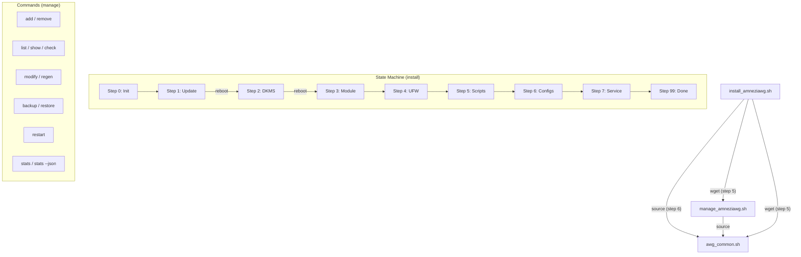

<p align="center">
  🇷🇺 <a href="ADVANCED.md">Русский</a> | 🇬🇧 <b>English</b>
</p>

# AmneziaWG 2.0 Installer: Advanced Documentation

This is a supplement to the main [README.en.md](README.en.md), containing deeper technical details, explanations, and advanced options for the AmneziaWG 2.0 installation and management scripts.

## Table of Contents

<a id="toc-adv"></a>
- [✨ Features (Detailed)](#features-detailed-adv)
- [🔐 AWG 2.0 Parameters](#awg2-params-adv)
- [⚙️ Client Configuration Details](#config-details-adv)
  - [AllowedIPs](#allowedips-adv)
  - [PersistentKeepalive](#persistentkeepalive-adv)
  - [DNS](#dns-adv)
  - [Changing Default Settings](#change-defaults-adv)
- [🔒 Server Security Settings](#security-adv)
  - [UFW Firewall](#ufw-adv)
  - [Kernel Parameters (Sysctl)](#sysctl-adv)
  - [Fail2Ban (Automatic Setup)](#fail2ban-adv)
- [🧹 Server Optimization](#optimization-adv)
- [📋 Configuration Examples](#config-examples-adv)
- [⚙️ CLI Parameters](#cli-params-adv)
  - [install_amneziawg.sh](#install-cli-adv)
  - [manage_amneziawg.sh](#manage-cli-adv)
- [🧑‍💻 Full List of Management Commands](#manage-commands-adv)
- [🛠️ Technical Details](#tech-details-adv)
  - [Script Architecture](#architecture-adv)
  - [DKMS](#dkms-adv)
  - [Key and Config Generation](#keygen-adv)
- [🔄 How to Update Scripts](#update-scripts-adv)
- [❓ FAQ (Additional Questions)](#faq-advanced-adv)
- [🩺 Diagnostics and Uninstall](#diag-uninstall-adv)
  - [Diagnostic Report Contents](#diagnostic-report-adv)
- [🔧 Troubleshooting (Detailed)](#troubleshooting-adv)
- [📊 Traffic Statistics (stats)](#stats-adv)
- [⏳ Temporary Clients (--expires)](#expires-adv)
- [📱 vpn:// URI Import](#vpnuri-adv)
- [🐧 Debian Support](#debian-support-adv)
- [🤝 Contributing](#contributing-adv)
- [💖 Acknowledgements](#thanks-adv)

---

<a id="features-detailed-adv"></a>
## ✨ Features (Detailed)

* **AmneziaWG 2.0:** Support for the next-generation protocol with extended obfuscation parameters (H1-H4 ranges, S3-S4, CPS I1).
* **Native key generation:** Keys are generated via `awg genkey/pubkey`, configs via Bash templates, QR codes via `qrencode`. The external Python/awgcfg.py dependency has been completely removed.
* **Automated installation:** Installs AmneziaWG, DKMS module, dependencies, configures networking, firewall, and sysctl.
* **Resume after reboot:** Uses a state file (`/root/awg/setup_state`) to continue after required reboots.
* **Automated system optimization:**
    * Removal of unnecessary packages (snapd, modemmanager, etc.)
    * Hardware-aware swap and network buffer tuning
    * NIC offload disabling (GRO/GSO/TSO) for VPN optimization
* **Secure by default:**
    * `UFW`: Policy `deny incoming`, SSH rate-limiting, VPN port allowed.
    * `IPv6`: Disabled by default via `sysctl` (optional).
    * `File permissions`: Strict permissions (600/700) on all keys and configs.
    * `Sysctl`: BBR congestion control, anti-spoofing, TCP optimization.
    * `Fail2Ban`: Automatic installation and SSH protection.
* **Backup:** `backup` command in the management script (including client keys).

---

<a id="awg2-params-adv"></a>
## 🔐 AWG 2.0 Parameters

All parameters are generated automatically during installation and saved to `/root/awg/awgsetup_cfg.init`. They are identical for the server and all clients.

| Parameter | Description | Range | Example |
|-----------|-------------|-------|---------|
| `Jc` | Number of junk packets | 4-8 | `6` |
| `Jmin` | Min junk size (bytes) | 40-89 | `55` |
| `Jmax` | Max junk size (bytes) | Jmin+100..Jmin+999 | `780` |
| `S1` | Init message padding (bytes) | 15-150 | `72` |
| `S2` | Response message padding (bytes) | 15-150, S1+56≠S2 | `56` |
| `S3` | Cookie message padding (bytes) | 8-55 | `32` |
| `S4` | Data message padding (bytes) | 4-27 | `16` |
| `H1` | Init message identifier | uint32 range | `134567-245678` |
| `H2` | Response message identifier | uint32 range | `3456789-4567890` |
| `H3` | Cookie message identifier | uint32 range | `56789012-67890123` |
| `H4` | Data message identifier | uint32 range | `456789012-567890123` |
| `I1` | CPS concealment packet | Format `<r N>` | `<r 128>` |

**Critical constraints:**
* H1-H4 ranges **must not overlap** (guaranteed by the generation algorithm).
* `S1 + 56 ≠ S2` — prevents init and response messages from having the same size.
* All nodes (server + clients) **must** use identical parameters.

---

<a id="config-details-adv"></a>
## ⚙️ Client Configuration Details

<a id="allowedips-adv"></a>
### AllowedIPs

Defines which traffic the **client** routes through the VPN tunnel.

1.  **Mode 1: All traffic (`0.0.0.0/0`)**
    * All client IPv4 traffic → VPN.
    * Maximum privacy. May block LAN access.

2.  **Mode 2: Amnezia List + DNS (Default)**
    * List of public IP ranges + DNS `1.1.1.1`, `8.8.8.8`.
    * **Purpose:** DPI bypass, DNS tunneling. Recommended.

3.  **Mode 3: Custom (Split-Tunneling)**
    * Only traffic to specified networks → VPN.
    * Example: `192.168.1.0/24,10.50.0.0/16`

**AllowedIPs Calculator:** [WireGuard AllowedIPs Calculator](https://www.procustodibus.com/blog/2021/03/wireguard-allowedips-calculator/).

<a id="persistentkeepalive-adv"></a>
### PersistentKeepalive

* **Default value:** `33` seconds.
* Maintains the UDP session through NAT.
* **Change:** `sudo bash /root/awg/manage_amneziawg.sh modify <name> PersistentKeepalive 25`

<a id="dns-adv"></a>
### DNS

* **Default value:** `1.1.1.1` (Cloudflare).
* DNS server for the client inside the VPN.
* **Change:** `sudo bash /root/awg/manage_amneziawg.sh modify <name> DNS "8.8.8.8,1.0.0.1"`

<a id="change-defaults-adv"></a>
### Changing Default Settings

To change the default DNS or PersistentKeepalive for **new** clients, edit the `render_client_config()` function in `awg_common.sh` **before** the first run.

---

<a id="security-adv"></a>
## 🔒 Server Security Settings

<a id="ufw-adv"></a>
### UFW Firewall

* **Policies:** Deny incoming, Allow outgoing.
* **Rules:** `limit 22/tcp` (SSH), `allow <vpn_port>/udp`.
* **Check:** `sudo ufw status verbose`

<a id="sysctl-adv"></a>
### Kernel Parameters (Sysctl)

File: `/etc/sysctl.d/99-amneziawg-security.conf`. Includes:
* IP forwarding
* IPv6 disable (optional)
* BBR congestion control + FQ qdisc
* TCP hardening (syncookies, rp_filter, RFC1337)
* ICMP redirects and source routing disabled
* Adaptive network buffers (rmem/wmem based on RAM)
* nf_conntrack_max = 65536
* kernel.sysrq = 0

<a id="fail2ban-adv"></a>
### Fail2Ban (Automatic Setup)

* Automatically installed and configured for SSH protection.
* **Settings:** Ban via `ufw`, 5 attempts → 1-hour ban.
* **Check:** `sudo fail2ban-client status sshd`.

---

<a id="optimization-adv"></a>
## 🧹 Server Optimization

The installer automatically optimizes the server:

**Removed packages:** `snapd`, `modemmanager`, `networkd-dispatcher`, `unattended-upgrades`, `packagekit`, `lxd-agent-loader`, `udisks2`. Cloud-init is removed **only** if it does not manage network configuration.

**Hardware-aware settings:**
* **Swap:** 1 GB if RAM ≤ 2 GB, 512 MB if RAM > 2 GB. `vm.swappiness = 10`.
* **NIC:** GRO/GSO/TSO offloads disabled (can interfere with VPN traffic).
* **Network buffers:** Automatic `rmem_max`/`wmem_max` tuning based on available RAM.

---

<a id="config-examples-adv"></a>
## 📋 Configuration Examples

<details>
<summary><strong>awgsetup_cfg.init (installation parameters)</strong></summary>

```bash
# AmneziaWG 2.0 installation configuration (auto-generated)
export AWG_PORT=39743
export AWG_TUNNEL_SUBNET='10.9.9.1/24'
export DISABLE_IPV6=1
export ALLOWED_IPS_MODE=2
export ALLOWED_IPS='0.0.0.0/5, 8.0.0.0/7, ...'
export AWG_ENDPOINT=''
export AWG_Jc=6
export AWG_Jmin=55
export AWG_Jmax=780
export AWG_S1=72
export AWG_S2=56
export AWG_S3=32
export AWG_S4=16
export AWG_H1='234567-345678'
export AWG_H2='3456789-4567890'
export AWG_H3='56789012-67890123'
export AWG_H4='456789012-567890123'
export AWG_I1='<r 128>'
```
</details>

<details>
<summary><strong>awg0.conf (server config, keys masked)</strong></summary>

```ini
[Interface]
PrivateKey = [SERVER_PRIVATE_KEY]
Address = 10.9.9.1/24
ListenPort = 39743
PostUp = iptables -A FORWARD -i %i -j ACCEPT; iptables -t nat -A POSTROUTING -o eth0 -j MASQUERADE
PostDown = iptables -D FORWARD -i %i -j ACCEPT; iptables -t nat -D POSTROUTING -o eth0 -j MASQUERADE
Jc = 6
Jmin = 55
Jmax = 780
S1 = 72
S2 = 56
S3 = 32
S4 = 16
H1 = 234567-345678
H2 = 3456789-4567890
H3 = 56789012-67890123
H4 = 456789012-567890123
I1 = <r 128>

[Peer]
#_Name = my_phone
PublicKey = [CLIENT_PUBLIC_KEY]
AllowedIPs = 10.9.9.2/32
```
</details>

<details>
<summary><strong>client.conf (client config, keys masked)</strong></summary>

```ini
[Interface]
PrivateKey = [CLIENT_PRIVATE_KEY]
Address = 10.9.9.2/32
DNS = 1.1.1.1
Jc = 6
Jmin = 55
Jmax = 780
S1 = 72
S2 = 56
S3 = 32
S4 = 16
H1 = 234567-345678
H2 = 3456789-4567890
H3 = 56789012-67890123
H4 = 456789012-567890123
I1 = <r 128>

[Peer]
PublicKey = [SERVER_PUBLIC_KEY]
Endpoint = 203.0.113.1:39743
AllowedIPs = 0.0.0.0/5, 8.0.0.0/7, ...
PersistentKeepalive = 33
```
</details>

---

<a id="cli-params-adv"></a>
## 🖥️ CLI Parameters

<a id="install-cli-adv"></a>
### install_amneziawg.sh (v5.6.0)

```
Options:
  -h, --help            Show help
  --uninstall           Uninstall AmneziaWG
  --diagnostic          Generate diagnostic report
  -v, --verbose         Verbose output (including DEBUG)
  --no-color            Disable colored output
  --port=PORT           Set UDP port (1024-65535)
  --subnet=SUBNET       Set tunnel subnet (x.x.x.x/yy)
  --allow-ipv6          Keep IPv6 enabled
  --disallow-ipv6       Force-disable IPv6
  --route-all           Mode: All traffic (0.0.0.0/0)
  --route-amnezia       Mode: Amnezia List + DNS (default)
  --route-custom=NETS   Mode: Only specified networks
  --endpoint=IP         Specify external IP (for servers behind NAT)
  -y, --yes             Non-interactive mode (all confirmations auto-yes)
```

<a id="manage-cli-adv"></a>
### manage_amneziawg.sh (v5.6.0)

```
Options:
  -h, --help            Show help
  -v, --verbose         Verbose output (for list)
  --no-color            Disable colored output
  --conf-dir=PATH       Specify AWG directory (default: /root/awg)
  --server-conf=PATH    Specify server config file
  --json                JSON output (for stats command)
  --expires=DURATION    Expiry duration for add (1h, 12h, 1d, 7d, 30d, 4w)
```

---

<a id="manage-commands-adv"></a>
## 🧑‍💻 Full List of Management Commands

Usage: `sudo bash /root/awg/manage_amneziawg.sh <command>`:

* **`add <name> [--expires=DURATION]`:** Add a client (key generation, config, QR code, vpn:// URI, peer addition). With `--expires` — time-limited client.
* **`remove <name>`:** Remove a client (config, keys, server config entry).
* **`list [-v]`:** List clients (with details when using `-v`).
* **`regen [name]`:** Regenerate `.conf`/`.png` files for one or all clients.
* **`modify <name> <param> <value>`:** Modify a client parameter in the `.conf` file. Allowed parameters: DNS, Endpoint, AllowedIPs, Address, PersistentKeepalive, MTU.
* **`backup`:** Create a backup (configs + keys).
* **`restore [file]`:** Restore from a backup.
* **`check` / `status`:** Check server status (service, port, AWG 2.0 parameters).
* **`show`:** Run `awg show`.
* **`restart`:** Restart the AmneziaWG service.
* **`help`:** Show help.
* **`stats [--json]`:** Per-client traffic statistics. With `--json` — machine-readable format for integration.

### Usage Examples

```bash
# Change client DNS
sudo bash /root/awg/manage_amneziawg.sh modify my_phone DNS "8.8.8.8,1.0.0.1"

# Change PersistentKeepalive
sudo bash /root/awg/manage_amneziawg.sh modify my_phone PersistentKeepalive 25

# Change AllowedIPs (split-tunneling)
sudo bash /root/awg/manage_amneziawg.sh modify my_phone AllowedIPs "192.168.1.0/24,10.0.0.0/8"

# Regenerate config for a single client
sudo bash /root/awg/manage_amneziawg.sh regen my_phone

# Create a backup
sudo bash /root/awg/manage_amneziawg.sh backup

# Restore from the latest backup (interactive selection)
sudo bash /root/awg/manage_amneziawg.sh restore
```

---

<a id="tech-details-adv"></a>
## 🛠️ Technical Details

<a id="architecture-adv"></a>
### Script Architecture (v5.6.0)

| File | Purpose |
|------|---------|
| `install_amneziawg.sh` | Installer: 8-step state machine with resume support |
| `manage_amneziawg.sh` | Management: add/remove/list/regen/stats/backup/restore |
| `awg_common.sh` | Shared library: keys, configs, QR, peer management |
| `install_amneziawg_en.sh` | Installer (English version) |
| `manage_amneziawg_en.sh` | Management (English version) |
| `awg_common_en.sh` | Shared library (English version) |

`awg_common.sh` is loaded via `source` from both scripts. The installer downloads it at step 5.



<a id="dkms-adv"></a>
### DKMS

Ensures automatic rebuilding of the `amneziawg` kernel module on kernel updates. Check: `dkms status`.

<a id="keygen-adv"></a>
### Key and Config Generation

**Fully native** generation:
* **Keys:** `awg genkey` + `awg pubkey` (standard AmneziaWG utilities).
* **Configs:** Bash templates with AWG 2.0 parameters.
* **QR codes:** `qrencode -t png`.
* **Python/awgcfg.py:** Completely removed. The config deletion bug workaround is no longer needed.

Client keys are stored in `/root/awg/keys/` (permissions 600). Server keys are in `/root/awg/server_private.key` and `server_public.key`.

---

<a id="update-scripts-adv"></a>
## 🔄 How to Update Scripts

To update the management and shared library scripts **without reinstalling the server**:

```bash
# Russian version:
wget -O /root/awg/manage_amneziawg.sh https://raw.githubusercontent.com/bivlked/amneziawg-installer/main/manage_amneziawg.sh
wget -O /root/awg/awg_common.sh https://raw.githubusercontent.com/bivlked/amneziawg-installer/main/awg_common.sh

# English version:
wget -O /root/awg/manage_amneziawg.sh https://raw.githubusercontent.com/bivlked/amneziawg-installer/main/manage_amneziawg_en.sh
wget -O /root/awg/awg_common.sh https://raw.githubusercontent.com/bivlked/amneziawg-installer/main/awg_common_en.sh

# Set permissions
chmod 700 /root/awg/manage_amneziawg.sh /root/awg/awg_common.sh
```

> **Note:** Reinstalling `install_amneziawg.sh` is **not required** for management updates. A reinstallation is only necessary when switching protocol versions.

---

<a id="faq-advanced-adv"></a>
## ❓ FAQ (Additional Questions)

<details>
  <summary><strong>Q: How do I change the AmneziaWG port after installation?</strong></summary>
  <b>A:</b> 1. Change <code>ListenPort</code> in <code>/etc/amnezia/amneziawg/awg0.conf</code>. 2. Change <code>AWG_PORT</code> in <code>/root/awg/awgsetup_cfg.init</code>. 3. Update UFW (<code>sudo ufw delete allow &lt;old_port&gt;/udp</code>, <code>sudo ufw allow &lt;new_port&gt;/udp</code>). 4. Restart the service (<code>sudo systemctl restart awg-quick@awg0</code>). 5. <b>Regenerate ALL client configs</b> (<code>sudo bash /root/awg/manage_amneziawg.sh regen</code>) and distribute them.
</details>

<details>
  <summary><strong>Q: How do I change the internal VPN subnet?</strong></summary>
  <b>A:</b> The easiest way is to uninstall (<code>sudo bash ./install_amneziawg.sh --uninstall</code>) and reinstall, specifying the new subnet during initial setup.
</details>

<details>
  <summary><strong>Q: How do I change the MTU?</strong></summary>
  <b>A:</b> Add a line <code>MTU = &lt;value&gt;</code> (e.g., <code>MTU = 1420</code>) to the <code>[Interface]</code> section of <code>/etc/amnezia/amneziawg/awg0.conf</code> and to client <code>.conf</code> files. Restart the service.
</details>

<details>
  <summary><strong>Q: Where are the AWG 2.0 parameters stored?</strong></summary>
  <b>A:</b> In <code>/root/awg/awgsetup_cfg.init</code> (variables AWG_Jc, AWG_S1..S4, AWG_H1..H4, AWG_I1). These same parameters are written to the server and client configs.
</details>

<details>
  <summary><strong>Q: Can I change AWG 2.0 parameters after installation?</strong></summary>
  <b>A:</b> Not recommended. Parameters must be identical on the server and all clients. If necessary: 1) Stop the service. 2) Change parameters in <code>awgsetup_cfg.init</code> and <code>awg0.conf</code>. 3) Regenerate all client configs (<code>manage regen</code>). 4) Start the service. 5) Distribute new configs to clients.
</details>

<details>
  <summary><strong>Q: Server behind NAT — how do I specify the external IP?</strong></summary>
  <b>A:</b> Use the <code>--endpoint=&lt;external_IP&gt;</code> flag during installation: <code>sudo bash ./install_amneziawg.sh --endpoint=1.2.3.4</code>. Or specify it later via <code>sudo bash /root/awg/manage_amneziawg.sh regen</code> (the script will attempt to detect the IP automatically).
</details>

<details>
  <summary><strong>Q: How do I set up port forwarding (NAT) for AmneziaWG?</strong></summary>
  <b>A:</b> If the server is behind NAT (e.g., in a cloud with a private IP): 1. Forward the AmneziaWG UDP port (default 39743) to the external IP. 2. During installation, specify the external IP: <code>--endpoint=EXTERNAL_IP</code>. 3. Make sure the provider's firewall allows incoming UDP on that port.
</details>

<details>
  <summary><strong>Q: How do I change DNS for all existing clients?</strong></summary>
  <b>A:</b> Use the <code>modify</code> command for each client: <code>sudo bash /root/awg/manage_amneziawg.sh modify &lt;name&gt; DNS "8.8.8.8,1.0.0.1"</code>. Then regenerate configs: <code>sudo bash /root/awg/manage_amneziawg.sh regen</code>. To change the default DNS for new clients, edit <code>awg_common.sh</code>.
</details>

<details>
  <summary><strong>Q: How do I monitor VPN traffic?</strong></summary>
  <b>A:</b> 1. Current connections: <code>sudo awg show</code>. 2. Transfer stats: <code>sudo awg show awg0 transfer</code>. 3. Service logs: <code>sudo journalctl -u awg-quick@awg0 -f</code>. 4. Overall status: <code>sudo bash /root/awg/manage_amneziawg.sh check</code>.
</details>

<details>
  <summary><strong>Q: "Invalid key: s3" error when importing config in the Windows client?</strong></summary>
  <b>A:</b> You're using <code>amneziawg-windows-client</code> — a standalone tunnel manager that only supports AWG 1.x and <b>does not understand</b> AWG 2.0 parameters (S3, S4, I1, H1-H4 ranges). Install the full <a href="https://github.com/amnezia-vpn/amnezia-client/releases"><b>Amnezia VPN</b></a> client version <b>>= 4.8.12.7</b>. The configs generated by the script are perfectly valid — you just need the right client.
</details>

<details>
  <summary><strong>Q: DKMS error after kernel update — what should I do?</strong></summary>
  <b>A:</b> 1. Check status: <code>dkms status</code>. 2. Try rebuilding: <code>sudo dkms install amneziawg/$(dkms status | grep amneziawg | head -1 | awk -F'[,/ ]+' '{print $2}')</code>. 3. Make sure kernel headers are installed: <code>sudo apt install linux-headers-$(uname -r)</code>. 4. If the error persists, run diagnostics: <code>sudo bash ./install_amneziawg.sh --diagnostic</code>.
</details>

<details>
  <summary><strong>Q: Detailed steps for VPN migration to another server?</strong></summary>
  <b>A:</b> 1. On the old server: <code>sudo bash /root/awg/manage_amneziawg.sh backup</code>. 2. Copy the archive: <code>scp root@old_server:/root/awg/backups/*.tar.gz .</code>. 3. Install AmneziaWG on the new server. 4. Copy the backup: <code>scp *.tar.gz root@new_server:/root/awg/</code>. 5. Restore: <code>sudo bash /root/awg/manage_amneziawg.sh restore /root/awg/backup.tar.gz</code>. 6. Regenerate configs with new IP: <code>sudo bash /root/awg/manage_amneziawg.sh regen</code>. 7. Distribute new configs to clients.
</details>

<details>
  <summary><strong>Q: How do I limit bandwidth for clients?</strong></summary>
  <b>A:</b> AmneziaWG has no built-in bandwidth limiting. Use <code>tc</code> (traffic control): <code>sudo tc qdisc add dev awg0 root tbf rate 100mbit burst 32kbit latency 400ms</code>. This limits total interface throughput. For per-client limits, a more complex setup with <code>tc</code> and <code>iptables</code> (mark + class) is required.
</details>

---

<a id="diag-uninstall-adv"></a>
## 🩺 Diagnostics and Uninstall

* **Diagnostics:** `sudo bash /path/to/install_amneziawg.sh --diagnostic`. The report (including AWG 2.0 parameters) is saved to `/root/awg/diag_*.txt`.
* **Uninstall:** `sudo bash /path/to/install_amneziawg.sh --uninstall`. Will ask for confirmation and offer to create a backup.

<a id="diagnostic-report-adv"></a>
### Diagnostic Report Contents

The report (`--diagnostic`) includes the following sections:

| Section | Description |
|---------|-------------|
| OS | Ubuntu and kernel version |
| Hardware | RAM, CPU, Swap |
| Configuration | Contents of `awgsetup_cfg.init` |
| Server Config | `awg0.conf` (private key hidden) |
| Service Status | Systemd service status |
| AWG Status | Output of `awg show` |
| Network | Interfaces, ports, routes |
| Firewall | UFW rules |
| Journal | Last 50 lines of service log |
| DKMS | Kernel module status |

---

<a id="troubleshooting-adv"></a>
## 🔧 Troubleshooting (Detailed)

<details>
<summary><strong>No internet after connecting to VPN</strong></summary>

1. Check IP forwarding: `sysctl net.ipv4.ip_forward` (should be 1)
2. Check NAT rules: `iptables -t nat -L POSTROUTING -v`
3. Check client AllowedIPs (routing mode)
4. Check DNS: `nslookup google.com` from VPN
5. Check MTU: `ping -s 1280 -M do <server_IP>` — if it fails, reduce MTU
</details>

<details>
<summary><strong>Handshake succeeds but traffic doesn't flow</strong></summary>

1. Check MTU: add `MTU = 1280` to `[Interface]` in both server and client configs
2. Check iptables: `iptables -L FORWARD -v` — there should be an ACCEPT rule for awg0
3. Check NIC: `ip route get 1.1.1.1` — make sure PostUp/PostDown use the correct interface
</details>

<details>
<summary><strong>Port is occupied by another process</strong></summary>

1. Identify the process: `ss -lunp | grep :<port>`
2. Change the AmneziaWG port or stop the conflicting service
3. For port change instructions, see the FAQ "How do I change the port"
</details>

---

<a id="stats-adv"></a>
## 📊 Traffic Statistics (stats)

The `stats` command displays per-client traffic statistics.

**Standard output:**

```bash
sudo bash /root/awg/manage_amneziawg.sh stats
```

```
Client          Received        Sent            Latest handshake
───────────────────────────────────────────────────────────────────
my_phone        1.24 GiB        356.7 MiB       2 minutes ago
laptop          892.3 MiB       128.4 MiB       15 seconds ago
guest           0 B             0 B             (none)
```

**JSON output:**

```bash
sudo bash /root/awg/manage_amneziawg.sh stats --json
```

```json
[
  {
    "name": "my_phone",
    "public_key": "abc123...",
    "received_bytes": 1332477952,
    "sent_bytes": 374083174,
    "latest_handshake": 1710312180
  }
]
```

---

<a id="expires-adv"></a>
## ⏳ Temporary Clients (--expires)

Create clients with automatic removal after expiration.

**Creating:**

```bash
sudo bash /root/awg/manage_amneziawg.sh add guest --expires=7d
```

**Duration formats:**

| Format | Description |
|--------|-------------|
| `1h` | 1 hour |
| `12h` | 12 hours |
| `1d` | 1 day |
| `7d` | 7 days |
| `30d` | 30 days |
| `4w` | 4 weeks |

**How it works:**

1. When a client is created with `--expires`, an expiration timestamp is saved to `/root/awg/expiry/<name>`.
2. A cron job `/etc/cron.d/awg-expiry` checks every 5 minutes.
3. Expired clients are automatically removed (config, keys, server config entry).
4. When the last expiry client is removed, the cron job is automatically cleaned up.

**Checking:** `list -v` shows remaining time for each client with an expiry.

---

<a id="vpnuri-adv"></a>
## 📱 vpn:// URI Import

When a client is created, a `.vpnuri` file is automatically generated with a `vpn://` URI for quick import into Amnezia Client.

**File location:** `/root/awg/<client_name>.vpnuri`

**Format:** The configuration is compressed via zlib (Perl `Compress::Zlib`) and Base64-encoded, forming a URI like `vpn://...`.

**Using with Amnezia Client:**

1. Copy the contents of the `.vpnuri` file
2. Open Amnezia Client
3. "Add VPN" → "Paste from clipboard"
4. The configuration is imported automatically

**Permissions:** `.vpnuri` files have 600 permissions (root only).

---

<a id="debian-support-adv"></a>
## 🐧 Debian Support

Starting with v5.6.0, the installer fully supports Debian 12 (bookworm) and Debian 13 (trixie).

**Ubuntu vs Debian differences:**

| Aspect | Ubuntu 24.04 | Debian 12 (bookworm) | Debian 13 (trixie) |
|--------|-------------|---------------------|-------------------|
| PPA codename | native | mapped to `focal` | mapped to `noble` |
| APT format | `.list` | `.list` | DEB822 `.sources` |
| Headers | `linux-headers-$(uname -r)` | fallback to `linux-headers-amd64` | fallback to `linux-headers-amd64` |
| deb-src | Yes | No | No |
| snapd/lxd cleanup | Yes | Skipped | Skipped |

**Debian prerequisites:**

Minimal Debian installations do not include `curl`:

```bash
apt-get update && apt-get install -y curl
```

**Expected warnings:**

During installation on Debian, you may see a `sudo removal refused` warning — this is normal, as Debian uses `sudo` as a system package and the script correctly skips its removal.

---

<a id="contributing-adv"></a>
## 🤝 Contributing

Suggestions and fixes are welcome! Create an Issue or Pull Request in the [repository](https://github.com/bivlked/amneziawg-installer).

---

<a id="thanks-adv"></a>
## 💖 Acknowledgements

* The [Amnezia VPN](https://github.com/amnezia-vpn) team.

---

<p align="center">
  <a href="#amneziawg-20-installer-advanced-documentation">↑ Back to top</a>
</p>
