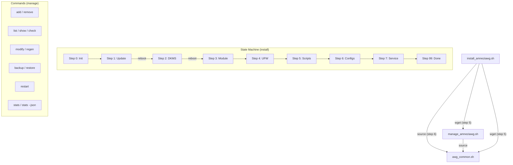

<p align="center">
  <b>RU</b> <a href="ADVANCED.md">Русский</a> | <b>EN</b> English
</p>

# AmneziaWG 2.0 Installer: Advanced Documentation

This is a supplement to the main [README.en.md](README.en.md), containing deeper technical details, explanations, and advanced options for the AmneziaWG 2.0 installation and management scripts.

## Table of Contents

<a id="toc-adv"></a>
- [✨ Features (Detailed)](#features-detailed-adv)
- [🔐 AWG 2.0 Parameters](#awg2-params-adv)
  - [Presets (v5.10.0+)](#presets-adv)
- [⚙️ Client Configuration Details](#config-details-adv)
  - [AllowedIPs](#allowedips-adv)
  - [PersistentKeepalive](#persistentkeepalive-adv)
  - [DNS](#dns-adv)
  - [Changing Default Settings](#change-defaults-adv)
- [🔒 Server Security Settings](#security-adv)
  - [UFW Firewall](#ufw-adv)
  - [Kernel Parameters (Sysctl)](#sysctl-adv)
  - [Fail2Ban (Automatic Setup)](#fail2ban-adv)
- [🧹 Server Optimization](#optimization-adv)
- [📋 Configuration Examples](#config-examples-adv)
- [⚙️ CLI Parameters](#cli-params-adv)
  - [install_amneziawg.sh](#install-cli-adv)
  - [manage_amneziawg.sh](#manage-cli-adv)
- [🧑‍💻 Full List of Management Commands](#manage-commands-adv)
- [🛠️ Technical Details](#tech-details-adv)
  - [Script Architecture](#architecture-adv)
  - [DKMS](#dkms-adv)
  - [Key and Config Generation](#keygen-adv)
- [🔄 How to Update Scripts](#update-scripts-adv)
- [❓ FAQ (Additional Questions)](#faq-advanced-adv)
- [🩺 Diagnostics and Uninstall](#diag-uninstall-adv)
  - [Diagnostic Report Contents](#diagnostic-report-adv)
- [🔧 Troubleshooting (Detailed)](#troubleshooting-adv)
- [📊 Traffic Statistics (stats)](#stats-adv)
- [⏳ Temporary Clients (--expires)](#expires-adv)
- [📱 vpn:// URI Import](#vpnuri-adv)
- [📱 MTU and Mobile Clients](#mtu-mobile-adv)
- [📋 AWG 2.0 Client Compatibility](#client-compat-adv)
- [🐧 Debian Support](#debian-support-adv)
- [🔧 Raspberry Pi and ARM64 Support](#arm-support-adv)
- [⚠️ Known Limitations](#limitations-adv)
- [🤝 Contributing](#contributing-adv)
- [💖 Acknowledgements](#thanks-adv)

---

> For the full version history, see [CHANGELOG.en.md](CHANGELOG.en.md).

---

<a id="features-detailed-adv"></a>
## ✨ Features (Detailed)

* **AmneziaWG 2.0:** Support for the next-generation protocol with extended obfuscation parameters (H1-H4 ranges, S3-S4, CPS I1).
* **Native key generation:** Keys are generated via `awg genkey/pubkey`, configs via Bash templates, QR codes via `qrencode`. The external Python/awgcfg.py dependency has been completely removed.
* **Automated installation:** Installs AmneziaWG, DKMS module, dependencies, configures networking, firewall, and sysctl.
* **Resume after reboot:** Uses a state file (`/root/awg/setup_state`) to continue after required reboots.
* **Automated system optimization:**
    * Removal of unnecessary packages (snapd, modemmanager, etc.)
    * Hardware-aware swap and network buffer tuning
    * NIC offload disabling (GRO/GSO/TSO) for VPN optimization
* **Secure by default:**
    * `UFW`: Policy `deny incoming`, SSH rate-limiting, VPN port allowed.
    * `IPv6`: Disabled by default via `sysctl` (optional).
    * `File permissions`: Strict permissions (600/700) on all keys and configs.
    * `Sysctl`: BBR congestion control, anti-spoofing, TCP optimization.
    * `Fail2Ban`: Automatic installation and SSH protection.
* **Backup:** `backup` command in the management script (including client keys).

---

<a id="awg2-params-adv"></a>
## 🔐 AWG 2.0 Parameters

All parameters are generated automatically during installation and saved to `/root/awg/awgsetup_cfg.init`. They are identical for the server and all clients.

| Parameter | Description | Range | Example |
|-----------|-------------|-------|---------|
| `Jc` | Number of junk packets | 3-6 | `5` |
| `Jmin` | Min junk size (bytes) | 40-89 | `55` |
| `Jmax` | Max junk size (bytes) | Jmin+50..Jmin+250 | `200` |
| `S1` | Init message padding (bytes) | 15-150 | `72` |
| `S2` | Response message padding (bytes) | 15-150, S1+56≠S2 | `56` |
| `S3` | Cookie message padding (bytes) | 8-55 | `32` |
| `S4` | Data message padding (bytes) | 4-27 | `16` |
| `H1` | Init message identifier | uint32 range | `134567-245678` |
| `H2` | Response message identifier | uint32 range | `3456789-4567890` |
| `H3` | Cookie message identifier | uint32 range | `56789012-67890123` |
| `H4` | Data message identifier | uint32 range | `456789012-567890123` |
| `I1` | CPS concealment packet | Format `<r N>` | `<r 128>` |

**Critical constraints:**
* H1-H4 ranges **must not overlap** (guaranteed by the generation algorithm).
* `S1 + 56 ≠ S2` — prevents init and response messages from having the same size.
* All nodes (server + clients) **must** use identical parameters.

<a id="presets-adv"></a>
### Presets (v5.10.0+)

Presets are ready-made obfuscation parameter profiles optimized for specific network conditions. Selected during installation via the `--preset` flag.

| Preset | Jc | Jmin | Jmax | When to use |
|--------|-----|------|------|------------|
| `default` | 3-6 (random) | 40-89 | Jmin + 50..250 | Home/wired internet, standard VPS |
| `mobile` | **3** (fixed) | 30-50 | Jmin + 20..80 | Mobile carriers (Tele2, Yota, Megafon, Tattelecom) |

**Installation with a preset:**

```bash
# Standard profile (default)
sudo bash install_amneziawg_en.sh --yes --route-amnezia

# Mobile profile — for SIM cards, LTE/5G modems, mobile routers
sudo bash install_amneziawg_en.sh --preset=mobile --yes --route-amnezia
```

> **Note:** `install_amneziawg_en.sh` and `install_amneziawg.sh` are functionally identical — only the output language differs.

**Fine-grained overrides (`--jc`, `--jmin`, `--jmax`):**

Individual parameters can be overridden on top of any preset:

```bash
# Mobile preset, but Jc=4 instead of 3
sudo bash install_amneziawg_en.sh --preset=mobile --jc=4 --yes --route-amnezia

# Fully manual parameters
sudo bash install_amneziawg_en.sh --jc=2 --jmin=20 --jmax=60 --yes --route-amnezia
```

| Flag | Range | Description |
|------|-------|------------|
| `--jc=N` | 1-128 | Number of junk packets |
| `--jmin=N` | 0-1280 | Minimum junk size (bytes) |
| `--jmax=N` | 0-1280 | Maximum junk size (bytes), must be ≥ Jmin |

> **Tip:** If VPN works on home Wi-Fi but is unstable on mobile data — reinstall with `--preset=mobile`. More about mobile carrier issues in the <a href="#faq-advanced-adv">FAQ</a>.

---

<a id="config-details-adv"></a>
## ⚙️ Client Configuration Details

<a id="allowedips-adv"></a>
### AllowedIPs

Defines which traffic the **client** routes through the VPN tunnel.

1.  **Mode 1: All traffic (`0.0.0.0/0`)**
    * All client IPv4 traffic → VPN.
    * Maximum privacy. May block LAN access.

2.  **Mode 2: Amnezia List + DNS (Default)**
    * List of public IP ranges + DNS `1.1.1.1`, `8.8.8.8`.
    * **Purpose:** DPI bypass, DNS tunneling. Recommended.

3.  **Mode 3: Custom (Split-Tunneling)**
    * Only traffic to specified networks → VPN.
    * Example: `192.168.1.0/24,10.50.0.0/16`

**AllowedIPs Calculator:** [WireGuard AllowedIPs Calculator](https://www.procustodibus.com/blog/2021/03/wireguard-allowedips-calculator/).

<a id="persistentkeepalive-adv"></a>
### PersistentKeepalive

* **Default value:** `33` seconds.
* Maintains the UDP session through NAT.
* **Change:** `sudo bash /root/awg/manage_amneziawg.sh modify <name> PersistentKeepalive 25`

<a id="dns-adv"></a>
### DNS

* **Default value:** `1.1.1.1` (Cloudflare).
* DNS server for the client inside the VPN.
* **Change:** `sudo bash /root/awg/manage_amneziawg.sh modify <name> DNS "8.8.8.8,1.0.0.1"`

<a id="change-defaults-adv"></a>
### Changing Default Settings

To change the default DNS or PersistentKeepalive for **new** clients, edit the `render_client_config()` function in `awg_common.sh` **before** the first run.

---

<a id="security-adv"></a>
## 🔒 Server Security Settings

<a id="ufw-adv"></a>
### UFW Firewall

* **Policies:** Deny incoming, Allow outgoing, Deny routed.
* **Rules:** `limit 22/tcp` (SSH), `allow <vpn_port>/udp`, `route allow in on awg0 out on <nic>` (VPN traffic forwarding, added in v5.7.6).
* **Check:** `sudo ufw status verbose`

<a id="sysctl-adv"></a>
### Kernel Parameters (Sysctl)

File: `/etc/sysctl.d/99-amneziawg-security.conf`. Includes:
* IP forwarding
* IPv6 disable (optional)
* BBR congestion control + FQ qdisc
* TCP hardening (syncookies, rp_filter, RFC1337)
* ICMP redirects and source routing disabled
* Adaptive network buffers (rmem/wmem based on RAM)
* nf_conntrack_max = 65536
* kernel.sysrq = 0

<a id="fail2ban-adv"></a>
### Fail2Ban (Automatic Setup)

* Automatically installed and configured for SSH protection.
* **Settings:** Ban via `ufw`, 5 attempts → 1-hour ban.
* **Debian:** Automatically uses `backend = systemd` (journald). Ubuntu uses `backend = auto`.
* **Check:** `sudo fail2ban-client status sshd`.

#### Safe Configuration Loading (v5.7.2)

Starting with v5.7.2, the `awgsetup_cfg.init` parameters file is loaded via `safe_load_config()` — a whitelist parser that only accepts predefined keys (`AWG_*`, `OS_*`, `DISABLE_IPV6`, `ALLOWED_IPS_*`, `NO_TWEAKS`, etc.). The previous `source` method has been completely replaced. The parser correctly handles values in both single and double quotes (`'value'` or `"value"`).

This protects against potential code injection: even if the configuration file is modified, arbitrary commands will not execute.

---

<a id="optimization-adv"></a>
## 🧹 Server Optimization

The installer automatically optimizes the server:

**Removed packages:** `snapd`, `modemmanager`, `networkd-dispatcher`, `unattended-upgrades`, `packagekit`, `lxd-agent-loader`, `udisks2`. Cloud-init is removed **only** if it does not manage network configuration.

**Hardware-aware settings:**
* **Swap:** 1 GB if RAM ≤ 2 GB, 512 MB if RAM > 2 GB. `vm.swappiness = 10`.
* **NIC:** GRO/GSO/TSO offloads disabled (can interfere with VPN traffic).
* **Network buffers:** Automatic `rmem_max`/`wmem_max` tuning based on available RAM.

---

<a id="config-examples-adv"></a>
## 📋 Configuration Examples

<details>
<summary><strong>awgsetup_cfg.init (installation parameters)</strong></summary>

```bash
# AmneziaWG 2.0 installation configuration (auto-generated)
export AWG_PORT=39743
export AWG_TUNNEL_SUBNET='10.9.9.1/24'
export DISABLE_IPV6=1
export ALLOWED_IPS_MODE=2
export ALLOWED_IPS='0.0.0.0/5, 8.0.0.0/7, ...'
export AWG_ENDPOINT=''
export AWG_Jc=6
export AWG_Jmin=55
export AWG_Jmax=205
export AWG_S1=72
export AWG_S2=56
export AWG_S3=32
export AWG_S4=16
export AWG_H1='234567-345678'
export AWG_H2='3456789-4567890'
export AWG_H3='56789012-67890123'
export AWG_H4='456789012-567890123'
export AWG_I1='<r 128>'
export AWG_PRESET='default'
```
</details>

<details>
<summary><strong>awg0.conf (server config, keys masked)</strong></summary>

```ini
[Interface]
PrivateKey = [SERVER_PRIVATE_KEY]
Address = 10.9.9.1/24
MTU = 1280
ListenPort = 39743
PostUp = iptables -I FORWARD -i %i -j ACCEPT; iptables -t nat -A POSTROUTING -o eth0 -j MASQUERADE
PostDown = iptables -D FORWARD -i %i -j ACCEPT; iptables -t nat -D POSTROUTING -o eth0 -j MASQUERADE
Jc = 6
Jmin = 55
Jmax = 205
S1 = 72
S2 = 56
S3 = 32
S4 = 16
H1 = 234567-345678
H2 = 3456789-4567890
H3 = 56789012-67890123
H4 = 456789012-567890123
I1 = <r 128>

[Peer]
#_Name = my_phone
PublicKey = [CLIENT_PUBLIC_KEY]
AllowedIPs = 10.9.9.2/32
```
</details>

<details>
<summary><strong>client.conf (client config, keys masked)</strong></summary>

```ini
[Interface]
PrivateKey = [CLIENT_PRIVATE_KEY]
Address = 10.9.9.2/32
DNS = 1.1.1.1
MTU = 1280
Jc = 6
Jmin = 55
Jmax = 205
S1 = 72
S2 = 56
S3 = 32
S4 = 16
H1 = 234567-345678
H2 = 3456789-4567890
H3 = 56789012-67890123
H4 = 456789012-567890123
I1 = <r 128>

[Peer]
PublicKey = [SERVER_PUBLIC_KEY]
Endpoint = 203.0.113.1:39743
AllowedIPs = 0.0.0.0/5, 8.0.0.0/7, ...
PersistentKeepalive = 33
```
</details>

---

<a id="cli-params-adv"></a>
## 🖥️ CLI Parameters

<a id="install-cli-adv"></a>
### install_amneziawg.sh

```
Options:
  -h, --help            Show help
  --uninstall           Uninstall AmneziaWG
  --diagnostic          Generate diagnostic report
  -v, --verbose         Verbose output (including DEBUG)
  --no-color            Disable colored output
  --port=PORT           Set UDP port (1024-65535)
  --subnet=SUBNET       Set tunnel subnet (x.x.x.x/yy)
  --allow-ipv6          Keep IPv6 enabled
  --disallow-ipv6       Force-disable IPv6
  --route-all           Mode: All traffic (0.0.0.0/0)
  --route-amnezia       Mode: Amnezia List + DNS (default)
  --route-custom=NETS   Mode: Only specified networks
  --endpoint=IP         Specify external IP (for servers behind NAT)
  --preset=TYPE         Obfuscation parameter preset: default, mobile
                        mobile: Jc=3, narrow Jmax — for mobile carriers (Tele2, Yota, Megafon)
  --jc=N                Set Jc manually (1-128, overrides preset)
  --jmin=N              Set Jmin manually (0-1280, overrides preset)
  --jmax=N              Set Jmax manually (0-1280, overrides preset, must be >= Jmin)
  -y, --yes             Non-interactive mode (all confirmations auto-yes)
  --no-tweaks           Skip hardening/optimization (no UFW, Fail2Ban, sysctl tweaks)
```

<a id="manage-cli-adv"></a>
### manage_amneziawg.sh

```
Options:
  -h, --help            Show help
  -v, --verbose         Verbose output (for list)
  --no-color            Disable colored output
  --conf-dir=PATH       Specify AWG directory (default: /root/awg)
  --server-conf=PATH    Specify server config file
  --json                JSON output (for stats command)
  --expires=DURATION    Expiry duration for add (1h, 12h, 1d, 7d, 30d, 4w)
  --apply-mode=MODE     syncconf (default) or restart (bypass kernel panic)
```

**Environment variables:**

| Variable | Description |
|----------|-------------|
| `AWG_SKIP_APPLY=1` | Skip apply_config. For automation: accumulate N operations, apply once |
| `AWG_APPLY_MODE=restart` | Full restart instead of syncconf (can be saved in `awgsetup_cfg.init`) |

---

<a id="manage-commands-adv"></a>
## 🧑‍💻 Full List of Management Commands

Usage: `sudo bash /root/awg/manage_amneziawg.sh <command>`:

* **`add <name> [name2 ...] [--expires=DURATION]`:** Add one or multiple clients. In batch mode, `awg syncconf` is called once for all. With `--expires` — expiry applies to all clients.
* **`remove <name> [name2 ...]`:** Remove one or multiple clients. In batch mode, apply_config is called once for all.
* **`list [-v]`:** List clients (with details when using `-v`).
* **`regen [name]`:** Regenerate `.conf`/`.png` files for one or all clients.
* **`modify <name> <param> <value>`:** Modify a client parameter in the `.conf` file. Allowed parameters: DNS, Endpoint, AllowedIPs, PersistentKeepalive. QR code and vpn:// URI are automatically regenerated after modification.
* **`backup`:** Create a backup (configs + keys + client expiry data + cron).
* **`restore [file]`:** Restore from a backup (including expiry data and cron job).
* **`check` / `status`:** Check server status (service, port, AWG 2.0 parameters).
* **`show`:** Run `awg show`.
* **`restart`:** Restart the AmneziaWG service.
* **`help`:** Show help.
* **`stats [--json]`:** Per-client traffic statistics. With `--json` — machine-readable format for integration.

### Usage Examples

```bash
# Change client DNS
sudo bash /root/awg/manage_amneziawg.sh modify my_phone DNS "8.8.8.8,1.0.0.1"

# Change PersistentKeepalive
sudo bash /root/awg/manage_amneziawg.sh modify my_phone PersistentKeepalive 25

# Change AllowedIPs (split-tunneling)
sudo bash /root/awg/manage_amneziawg.sh modify my_phone AllowedIPs "192.168.1.0/24,10.0.0.0/8"

# Regenerate config for a single client
sudo bash /root/awg/manage_amneziawg.sh regen my_phone

# Create a backup
sudo bash /root/awg/manage_amneziawg.sh backup

# Restore from the latest backup (interactive selection)
sudo bash /root/awg/manage_amneziawg.sh restore
```

---

<a id="tech-details-adv"></a>
## 🛠️ Technical Details

<a id="architecture-adv"></a>
### Script Architecture

| File | Purpose |
|------|---------|
| `install_amneziawg.sh` | Installer: 8-step state machine with resume support |
| `manage_amneziawg.sh` | Management: add/remove/list/regen/stats/backup/restore |
| `awg_common.sh` | Shared library: keys, configs, QR, peer management |
| `install_amneziawg_en.sh` | Installer (English version) |
| `manage_amneziawg_en.sh` | Management (English version) |
| `awg_common_en.sh` | Shared library (English version) |

`awg_common.sh` is loaded via `source` from both scripts. The installer downloads it at step 5.



<a id="dkms-adv"></a>
### DKMS

Ensures automatic rebuilding of the `amneziawg` kernel module on kernel updates. Check: `dkms status`.

<a id="keygen-adv"></a>
### Key and Config Generation

**Fully native** generation:
* **Keys:** `awg genkey` + `awg pubkey` (standard AmneziaWG utilities).
* **Configs:** Bash templates with AWG 2.0 parameters.
* **QR codes:** `qrencode -t png`.
* **Python/awgcfg.py:** Completely removed. The config deletion bug workaround is no longer needed.

Client keys are stored in `/root/awg/keys/` (permissions 600). Server keys are in `/root/awg/server_private.key` and `server_public.key`.

#### Version-Pinned URLs (v5.7.2)

The installer downloads `awg_common.sh` and `manage_amneziawg.sh` from URLs pinned to the specific version tag:

```
https://raw.githubusercontent.com/bivlked/amneziawg-installer/v5.10.2/awg_common.sh
```

This provides **supply chain pinning** — ensuring downloaded scripts match the installer version, even if `main` has already been updated.

For development, you can override the branch:

```bash
AWG_BRANCH=my-feature-branch sudo bash ./install_amneziawg_en.sh
```

---

<a id="update-scripts-adv"></a>
## 🔄 How to Update Scripts

To update the management and shared library scripts **without reinstalling the server**:

```bash
# Russian version:
wget -O /root/awg/manage_amneziawg.sh https://raw.githubusercontent.com/bivlked/amneziawg-installer/v5.10.2/manage_amneziawg.sh
wget -O /root/awg/awg_common.sh https://raw.githubusercontent.com/bivlked/amneziawg-installer/v5.10.2/awg_common.sh

# English version:
wget -O /root/awg/manage_amneziawg.sh https://raw.githubusercontent.com/bivlked/amneziawg-installer/v5.10.2/manage_amneziawg_en.sh
wget -O /root/awg/awg_common.sh https://raw.githubusercontent.com/bivlked/amneziawg-installer/v5.10.2/awg_common_en.sh

# Set permissions
chmod 700 /root/awg/manage_amneziawg.sh /root/awg/awg_common.sh
```

> **Note:** Reinstalling `install_amneziawg.sh` is **not required** for management updates. A reinstallation is only necessary when switching protocol versions.

---

<a id="faq-advanced-adv"></a>
## ❓ FAQ (Additional Questions)

<details>
  <summary><strong>Q: How do I change the AmneziaWG port after installation?</strong></summary>
  <b>A:</b> 1. Change <code>ListenPort</code> in <code>/etc/amnezia/amneziawg/awg0.conf</code>. 2. Change <code>AWG_PORT</code> in <code>/root/awg/awgsetup_cfg.init</code>. 3. Update UFW (<code>sudo ufw delete allow &lt;old_port&gt;/udp</code>, <code>sudo ufw allow &lt;new_port&gt;/udp</code>). 4. Restart the service (<code>sudo systemctl restart awg-quick@awg0</code>). 5. <b>Regenerate ALL client configs</b> (<code>sudo bash /root/awg/manage_amneziawg.sh regen</code>) and distribute them.
</details>

<details>
  <summary><strong>Q: How do I change the internal VPN subnet?</strong></summary>
  <b>A:</b> The easiest way is to uninstall (<code>sudo bash ./install_amneziawg_en.sh --uninstall</code>) and reinstall, specifying the new subnet during initial setup.
</details>

<details>
  <summary><strong>Q: How do I change the MTU?</strong></summary>
  <b>A:</b> Starting with v5.7.4, <code>MTU = 1280</code> is set automatically. To change it: edit the <code>MTU = &lt;value&gt;</code> line in the <code>[Interface]</code> section of <code>/etc/amnezia/amneziawg/awg0.conf</code> and in client <code>.conf</code> files. Restart the service. See <a href="#mtu-mobile-adv">MTU and Mobile Clients</a> for details.
</details>

<details>
  <summary><strong>Q: Where are the AWG 2.0 parameters stored?</strong></summary>
  <b>A:</b> In <code>/root/awg/awgsetup_cfg.init</code> (variables AWG_Jc, AWG_S1..S4, AWG_H1..H4, AWG_I1). These same parameters are written to the server and client configs.
</details>

<details>
  <summary><strong>Q: Can I change AWG 2.0 parameters after installation?</strong></summary>
  <b>A:</b> Yes. This is useful if your ISP started fingerprinting your server by static obfuscation parameters (e.g. Russian DPI blocked specific H1-H4 ranges). Workflow as of v5.8.0:
  <ol>
    <li>Edit parameters (Jc, S1-S4, H1-H4, I1) in the <code>[Interface]</code> section of <code>/etc/amnezia/amneziawg/awg0.conf</code>.</li>
    <li>Restart the service: <code>sudo systemctl restart awg-quick@awg0</code>.</li>
    <li>Regenerate every client config: <code>sudo bash /root/awg/manage_amneziawg.sh regen &lt;name&gt;</code>. As of v5.8.0, <code>regen</code> reads live values directly from <code>awg0.conf</code> (the source of truth) instead of the cached <code>awgsetup_cfg.init</code>.</li>
    <li>Distribute the new <code>.conf</code> / QR codes / vpn:// URIs to clients.</li>
  </ol>
  <b>Important:</b> server and client parameters must match — otherwise the handshake fails. The easiest way to get a fresh set of randomized non-overlapping H1-H4 ranges is to reinstall the server (<code>--uninstall</code> followed by a fresh install) — every install generates a unique set.
</details>

<details>
  <summary><strong>Q: Server behind NAT — how do I specify the external IP?</strong></summary>
  <b>A:</b> Use the <code>--endpoint=&lt;external_IP&gt;</code> flag during installation: <code>sudo bash ./install_amneziawg_en.sh --endpoint=1.2.3.4</code>. Or specify it later via <code>sudo bash /root/awg/manage_amneziawg.sh regen</code> (the script will attempt to detect the IP automatically).
</details>

<details>
  <summary><strong>Q: How do I set up port forwarding (NAT) for AmneziaWG?</strong></summary>
  <b>A:</b> If the server is behind NAT (e.g., in a cloud with a private IP): 1. Forward the AmneziaWG UDP port (default 39743) to the external IP. 2. During installation, specify the external IP: <code>--endpoint=EXTERNAL_IP</code>. 3. Make sure the provider's firewall allows incoming UDP on that port.
</details>

<details>
  <summary><strong>Q: How do I change DNS for all existing clients?</strong></summary>
  <b>A:</b> Use the <code>modify</code> command for each client: <code>sudo bash /root/awg/manage_amneziawg.sh modify &lt;name&gt; DNS "8.8.8.8,1.0.0.1"</code>. Then regenerate configs: <code>sudo bash /root/awg/manage_amneziawg.sh regen</code>. To change the default DNS for new clients, edit <code>awg_common.sh</code>.
</details>

<details>
  <summary><strong>Q: How do I monitor VPN traffic?</strong></summary>
  <b>A:</b> 1. Current connections: <code>sudo awg show</code>. 2. Transfer stats: <code>sudo awg show awg0 transfer</code>. 3. Service logs: <code>sudo journalctl -u awg-quick@awg0 -f</code>. 4. Overall status: <code>sudo bash /root/awg/manage_amneziawg.sh check</code>.
</details>

<details>
  <summary><strong>Q: "Invalid key: s3" error when importing config in the Windows client?</strong></summary>
  <b>A:</b> You're using an outdated version of <code>amneziawg-windows-client</code> (< 2.0.0) that doesn't understand AWG 2.0 parameters. Update to <a href="https://github.com/amnezia-vpn/amneziawg-windows-client/releases"><b>version 2.0.0+</b></a>. Alternatively, use <a href="https://github.com/amnezia-vpn/amnezia-client/releases"><b>Amnezia VPN</b></a> >= 4.8.12.7.
</details>

<details>
  <summary><strong>Q: DKMS error after kernel update — what should I do?</strong></summary>
  <b>A:</b> 1. Check status: <code>dkms status</code>. 2. Try rebuilding: <code>sudo dkms install amneziawg/$(dkms status | grep amneziawg | head -1 | awk -F'[,/ ]+' '{print $2}')</code>. 3. Make sure kernel headers are installed: <code>sudo apt install linux-headers-$(uname -r)</code>. 4. If the error persists, run diagnostics: <code>sudo bash ./install_amneziawg_en.sh --diagnostic</code>.
</details>

<details>
  <summary><strong>Q: Detailed steps for VPN migration to another server?</strong></summary>
  <b>A:</b> 1. On the old server: <code>sudo bash /root/awg/manage_amneziawg.sh backup</code>. 2. Copy the archive: <code>scp root@old_server:/root/awg/backups/awg_backup_*.tar.gz .</code>. 3. Install AmneziaWG on the new server. 4. Copy the backup: <code>scp awg_backup_*.tar.gz root@new_server:/root/awg/backups/</code>. 5. Restore: <code>sudo bash /root/awg/manage_amneziawg.sh restore</code> (interactive selection, or specify the full archive path). 6. Regenerate configs with new IP: <code>sudo bash /root/awg/manage_amneziawg.sh regen</code>. 7. Distribute new configs to clients.
</details>

<details>
  <summary><strong>Q: Smartphone doesn't connect over cellular / doesn't work on iPhone</strong></summary>
  <b>A:</b> Add <code>MTU = 1280</code> to the <code>[Interface]</code> section of both server and client configs. Cellular networks have lower MTU than the default 1420, and iOS is strict about PMTU. See <a href="#mtu-mobile-adv">MTU and Mobile Clients</a> for details.
</details>

<details>
  <summary><strong>Q: VPN connects over cellular only on the third attempt / unstable</strong></summary>
  <b>A:</b> Starting with v5.10.0, simply install with the <code>--preset=mobile</code> flag — it automatically sets optimal parameters for mobile networks (Jc=3, narrow Jmax). Discussion #38 (@elvaleto): on Tattelecom (Letai) with Jc=4-8 it took multiple attempts to connect, but after setting <code>Jc = 3</code> it worked immediately.
  <br><br>
  <b>Fresh install (recommended):</b>
  <pre>sudo bash install_amneziawg_en.sh --preset=mobile --yes --route-amnezia</pre>

  <b>Existing install — manual edit:</b>
  <ol>
    <li>Open <code>/etc/amnezia/amneziawg/awg0.conf</code> and change <code>Jc</code> to <code>3</code> and <code>I1</code> to <code>&lt;r 64&gt;</code>.</li>
    <li><code>sudo systemctl restart awg-quick@awg0</code></li>
    <li><code>sudo bash /root/awg/manage_amneziawg.sh regen &lt;client_name&gt;</code> for each client.</li>
    <li>Redistribute updated configs.</li>
  </ol>
  If <code>--preset=mobile</code> is not enough — try even lower values: <code>--jc=2 --jmin=20 --jmax=60</code>.
  <br><br>
  <b>Carrier reports (from issues/discussions):</b>
  <table>
  <tr><th>Carrier</th><th>Parameters</th><th>Recommendation</th><th>Result</th></tr>
  <tr><td>Tattelecom (Letai)</td><td>Jc=3, I1=&lt;r 64&gt;</td><td><code>--preset=mobile</code></td><td>✅</td></tr>
  <tr><td>Yota (Moscow)</td><td>I1=&lt;b 0xce...&gt;, Jmax=261</td><td><code>--preset=mobile</code></td><td>✅</td></tr>
  <tr><td>Yota/Tele2 (Moscow)</td><td>Jc=3, Jmin=40, Jmax=70</td><td><code>--preset=mobile</code></td><td>✅</td></tr>
  <tr><td>Tele2 (Krasnoyarsk)</td><td>Jc=3</td><td><code>--preset=mobile</code></td><td>✅</td></tr>
  <tr><td>Beeline</td><td>default</td><td><code>--preset=default</code></td><td>✅</td></tr>
  <tr><td>Megafon (Moscow)</td><td>Jc=3, Jmin=80, Jmax=268</td><td><code>--preset=mobile</code></td><td>🔄 testing</td></tr>
  </table>
</details>

<details>
  <summary><strong>Q: Script breaks the hoster VNC console / network drops on Hetzner</strong></summary>
  <b>A:</b> Before v5.8.2 the script set <code>net.ipv4.conf.all.rp_filter = 1</code> (strict reverse-path filtering). On Hetzner and similar cloud hosters where the gateway is in a different subnet than the VPS IP, strict mode breaks routing — reply packets fail the reverse-path check. Symptoms: VPS periodically loses network (once a day), and the VNC console fills with <code>[UFW BLOCK]</code> lines from Fail2Ban, making it unusable. Discussion #41 (@z036). As of v5.8.2 <code>rp_filter</code> is set to <code>2</code> (loose mode), which validates source IP against any route in the table (not just the same interface), and <code>kernel.printk = 3 4 1 3</code> is added to suppress non-critical kernel messages on the VNC console. If you are on a pre-v5.8.2 install — fix manually:
  <ol>
    <li>Open <code>/etc/sysctl.d/99-amneziawg-security.conf</code></li>
    <li>Change <code>rp_filter = 1</code> to <code>rp_filter = 2</code> (both lines: <code>conf.all</code> and <code>conf.default</code>)</li>
    <li>Add a line <code>kernel.printk = 3 4 1 3</code></li>
    <li><code>sudo sysctl -p /etc/sysctl.d/99-amneziawg-security.conf</code></li>
  </ol>
</details>

<details>
  <summary><strong>Q: Does AmneziaWG work in an LXC container?</strong></summary>
  <b>A:</b> No. AmneziaWG requires loading a kernel module via DKMS. LXC containers share the host kernel and cannot load custom modules. Use a full VM (KVM/QEMU) or bare-metal.
</details>

<details>
  <summary><strong>Q: <code>--endpoint</code> is rejected with "Invalid --endpoint" — what should I check?</strong></summary>
  <b>A:</b> As of v5.8.0, the value of <code>--endpoint</code> is validated before it is written to config files. Three formats are accepted: FQDN (<code>vpn.example.com</code>), IPv4 (<code>1.2.3.4</code>), and bracketed IPv6 (<code>[2001:db8::1]</code>). Newlines, CR, single and double quotes, backslash, spaces, and tabs are rejected — they could inject lines into <code>awgsetup_cfg.init</code> and client <code>.conf</code> files. IPv6 addresses must be wrapped in <code>[]</code>. If <code>AWG_ENDPOINT</code> in <code>awgsetup_cfg.init</code> fails validation on a later run, the installer emits <code>log_warn</code> and falls back to automatic detection via <code>get_server_public_ip</code>.
</details>

<details>
  <summary><strong>Q: "Another installer instance is already running" — what is this?</strong></summary>
  <b>A:</b> As of v5.8.0, the installer takes a process-wide <code>flock</code> on <code>/root/awg/.install.lock</code> at the beginning of <code>initialize_setup()</code>. This prevents two parallel runs from racing each other on <code>apt-get</code> and corrupting package state. If you see this error but no second installer is actually running (hung / crashed process), remove <code>/root/awg/.install.lock</code> and try again.
</details>

<details>
  <summary><strong>Q: Why did <code>--uninstall</code> not disable UFW?</strong></summary>
  <b>A:</b> This is the expected behaviour as of v5.8.0. The installer writes a marker file <code>/root/awg/.ufw_enabled_by_installer</code> <b>only if it had to enable UFW itself</b> (UFW was in <code>inactive</code> state before the install). During <code>--uninstall</code>, UFW is disabled <b>only</b> when that marker is present. If UFW was already active on the VPS before this script was installed (for example, protecting SSH or web services), <code>--uninstall</code> will remove our own rules (VPN port, <code>awg0</code> routing) but leave UFW running. This protects your firewall posture from destructive uninstall on a VPS that was already hardened. If you want to force UFW off anyway — run <code>ufw disable</code> manually.
</details>

<details>
  <summary><strong>Q: <code>regen</code> says "required AWG parameters missing" — what do I do?</strong></summary>
  <b>A:</b> As of v5.8.0, <code>load_awg_params</code> reads AWG parameters directly from the live <code>/etc/amnezia/amneziawg/awg0.conf</code> instead of the cached <code>awgsetup_cfg.init</code>. If you edited <code>awg0.conf</code> by hand and accidentally removed or corrupted one of the required fields (Jc, Jmin, Jmax, S1-S4, H1-H4), <code>regen</code> will fail with this error <b>instead of</b> silently using stale values from the init file. This is split-brain protection between server and clients. How to fix: (1) check that all 11 fields are present with <code>grep -E "^(Jc|Jmin|Jmax|S[1-4]|H[1-4]) = " /etc/amnezia/amneziawg/awg0.conf</code>; (2) if a field was removed, restore it from <code>/root/awg/awgsetup_cfg.init</code> or from an <code>awg0.conf.bak-*</code> backup; (3) restart the service and retry <code>regen</code>.
</details>

<details>
  <summary><strong>Q: <code>amneziawg-windows-client</code> underlines H2-H4 in red and will not let me edit the config</strong></summary>
  <b>A:</b> This is an upstream bug in the standalone Windows client <code>amneziawg-windows-client</code> (a wireguard-windows fork with AWG patches). Its built-in config editor in <code>ui/syntax/highlighter.go</code> caps H1-H4 at [0, 2147483647] (2^31-1, <code>INT32_MAX</code>), even though the AmneziaWG spec allows the full <code>uint32</code> (0-4294967295). Values above 2^31-1 work fine on the server, but the client underlines them as invalid and may block saving. Upstream issue: <a href="https://github.com/amnezia-vpn/amneziawg-windows-client/issues/85">amnezia-vpn/amneziawg-windows-client#85</a> (open since February 2026, not yet fixed). As of v5.8.1 our installer generates H1-H4 in the safe half of the range [0, 2^31-1] — fresh installs are compatible with the Windows client out of the box. If you already have a v5.8.0 install with "bad" H values: (1) upgrade via <code>--uninstall</code> + reinstall with v5.8.1 — new H values will be in the safe range; or (2) manually edit H2/H3/H4 in <code>awg0.conf</code> to values <b>less than 2147483647</b>, restart the service, and regenerate client configs with <code>manage regen &lt;name&gt;</code>; or (3) use the cross-platform <a href="https://github.com/amnezia-vpn/amnezia-client/releases">Amnezia VPN</a> client instead of <code>amneziawg-windows-client</code> — it does not have this limit. Discussion: <a href="https://github.com/bivlked/amneziawg-installer/discussions/40">#40</a>.
</details>

<details>
  <summary><strong>Q: Which client should I use for AWG 2.0?</strong></summary>
  <b>A:</b> Recommended: <a href="https://github.com/amnezia-vpn/amnezia-client/releases">Amnezia VPN</a> (version >= 4.8.12.7). Native AmneziaWG clients for Android and iOS also work. The standard WireGuard client <b>does not</b> support AWG parameters. See <a href="#client-compat-adv">AWG 2.0 Client Compatibility</a> for the full table.
</details>

<details>
  <summary><strong>Q: How do I limit bandwidth for clients?</strong></summary>
  <b>A:</b> AmneziaWG has no built-in bandwidth limiting. Use <code>tc</code> (traffic control): <code>sudo tc qdisc add dev awg0 root tbf rate 100mbit burst 32kbit latency 400ms</code>. This limits total interface throughput. For per-client limits, a more complex setup with <code>tc</code> and <code>iptables</code> (mark + class) is required.
</details>

---

<a id="diag-uninstall-adv"></a>
## 🩺 Diagnostics and Uninstall

* **Diagnostics:** `sudo bash /path/to/install_amneziawg_en.sh --diagnostic`. The report (including AWG 2.0 parameters) is saved to `/root/awg/diag_*.txt`.
* **Uninstall:** `sudo bash /path/to/install_amneziawg_en.sh --uninstall`. Will ask for confirmation and offer to create a backup.

<a id="diagnostic-report-adv"></a>
### Diagnostic Report Contents

The report (`--diagnostic`) includes the following sections:

| Section | Description |
|---------|-------------|
| OS | OS and kernel version |
| Hardware | RAM, CPU, Swap |
| Configuration | Contents of `awgsetup_cfg.init` |
| Server Config | `awg0.conf` (private key hidden) |
| Service Status | Systemd service status |
| AWG Status | Output of `awg show` |
| Network | Interfaces, ports, routes |
| Firewall | UFW rules |
| Journal | Last 50 lines of service log |
| DKMS | Kernel module status |

---

<a id="troubleshooting-adv"></a>
## 🔧 Troubleshooting (Detailed)

<details>
<summary><strong>No internet after connecting to VPN</strong></summary>

1. Check IP forwarding: `sysctl net.ipv4.ip_forward` (should be 1)
2. Check NAT rules: `iptables -t nat -L POSTROUTING -v`
3. Check client AllowedIPs (routing mode)
4. Check DNS: `nslookup google.com` from VPN
5. Check MTU: `ping -s 1280 -M do <server_IP>` — if it fails, reduce MTU
</details>

<details>
<summary><strong>Handshake succeeds but traffic doesn't flow</strong></summary>

1. Check MTU: add `MTU = 1280` to `[Interface]` in both server and client configs
2. Check iptables: `iptables -L FORWARD -v` — there should be an ACCEPT rule for awg0
3. Check NIC: `ip route get 1.1.1.1` — make sure PostUp/PostDown use the correct interface
</details>

<details>
<summary><strong>Port is occupied by another process</strong></summary>

1. Identify the process: `ss -lunp | grep :<port>`
2. Change the AmneziaWG port or stop the conflicting service
3. For port change instructions, see the FAQ "How do I change the port"
</details>

---

<a id="stats-adv"></a>
## 📊 Traffic Statistics (stats)

The `stats` command displays per-client traffic statistics.

**Standard output:**

```bash
sudo bash /root/awg/manage_amneziawg.sh stats
```

```
Client          Received        Sent            Latest handshake
───────────────────────────────────────────────────────────────────
my_phone        1.24 GiB        356.7 MiB       2 minutes ago
laptop          892.3 MiB       128.4 MiB       15 seconds ago
guest           0 B             0 B             (none)
```

**JSON output:**

```bash
sudo bash /root/awg/manage_amneziawg.sh stats --json
```

```json
[
  {
    "name": "my_phone",
    "ip": "10.9.9.2",
    "rx": 1332477952,
    "tx": 374083174,
    "last_handshake": 1710312180,
    "status": "active"
  }
]
```

---

<a id="expires-adv"></a>
## ⏳ Temporary Clients (--expires)

Create clients with automatic removal after expiration.

**Creating:**

```bash
sudo bash /root/awg/manage_amneziawg.sh add guest --expires=7d
```

**Duration formats:**

| Format | Description |
|--------|-------------|
| `1h` | 1 hour |
| `12h` | 12 hours |
| `1d` | 1 day |
| `7d` | 7 days |
| `30d` | 30 days |
| `4w` | 4 weeks |

**How it works:**

1. When a client is created with `--expires`, an expiration timestamp is saved to `/root/awg/expiry/<name>`.
2. A cron job `/etc/cron.d/awg-expiry` checks every 5 minutes.
3. Expired clients are automatically removed (config, keys, server config entry).
4. When the last expiry client is removed, the cron job is automatically cleaned up.

**Checking:** `list -v` shows remaining time for each client with an expiry.

---

<a id="vpnuri-adv"></a>
## 📱 vpn:// URI Import

When a client is created, a `.vpnuri` file is automatically generated with a `vpn://` URI for quick import into Amnezia Client.

**File location:** `/root/awg/<client_name>.vpnuri`

**Format:** The configuration is compressed via zlib (Perl `Compress::Zlib`) and Base64-encoded, forming a URI like `vpn://...`.

> Perl with `Compress::Zlib` and `MIME::Base64` modules must be present on the server. On Ubuntu and Debian they are installed by default. If Perl is absent, `.vpnuri` files are not created, but `.conf` files work as usual.

**Using with Amnezia Client:**

1. Copy the contents of the `.vpnuri` file
2. Open Amnezia Client
3. "Add VPN" → "Paste from clipboard"
4. The configuration is imported automatically

**Permissions:** `.vpnuri` files have 600 permissions (root only).

---

<a id="mtu-mobile-adv"></a>
## 📱 MTU and Mobile Clients

Starting with v5.7.4, `MTU = 1280` is set automatically in both server and client configs.

**Why:** Cellular networks (4G/LTE) often have an effective MTU below the default 1420, causing packet fragmentation or drops. iOS is strict about Path MTU Discovery and may fail to connect. 1280 is the minimum IPv6 MTU (RFC 8200), guaranteed to pass through any network. The speed impact is negligible.

**For installations before v5.7.4:**

Add `MTU = 1280` to the `[Interface]` section of both server and client configs manually. Restart the service:

```bash
sudo systemctl restart awg-quick@awg0
```

> vpn:// URIs for Amnezia Client have always included MTU = 1280 in all script versions.

---

<a id="client-compat-adv"></a>
## 📋 AWG 2.0 Client Compatibility

Not all clients support AWG 2.0. Check compatibility before choosing a client:

| Client | Platform | AWG 1.x | AWG 2.0 | Notes |
|--------|----------|---------|---------|-------|
| [Amnezia VPN](https://github.com/amnezia-vpn/amnezia-client/releases) | Windows, macOS, Linux, Android, iOS | ✅ | ✅ (>= 4.8.12.7) | Recommended. Supports vpn:// URI import |
| [AmneziaWG](https://github.com/amnezia-vpn/amneziawg-android) | Android | ✅ | ✅ (>= 2.0.0) | Lightweight tunnel manager. Import via `.conf` |
| [WG Tunnel](https://github.com/wgtunnel/android) | Android | ✅ | ⚠️ | FOSS client with auto-tunneling, split tunneling, F-Droid. AWG 2.0 — partial support |
| [AmneziaWG](https://apps.apple.com/app/amneziawg/id6478942365) | iOS | ✅ | ✅ | Native WG client for iOS |
| [WireSock VPN Client](https://www.ntkernel.com) | Windows | ✅ | ✅ | Commercial. Userspace WireGuard via NDISAPI |
| [AmneziaWG](https://github.com/amnezia-vpn/amneziawg-windows-client/releases) | Windows | ✅ | ✅ (>= 2.0.0) | Lightweight tunnel manager. Import via `.conf` |
| Standard WireGuard | All | ❌ | ❌ | Does not support AWG parameters |

> If a client shows an error about an unknown parameter (S3, S4, I1, or H1 as a range), use one of the first four clients in the table.

### Router Clients

| Project | Platform | Description |
|---------|----------|-------------|
| [AWG Manager](https://github.com/hoaxisr/awg-manager) | Keenetic (Entware) | Web interface for managing AWG tunnels on Keenetic routers |
| [AmneziaWG for Merlin](https://github.com/r0otx/asuswrt-merlin-amneziawg) | ASUS (Asuswrt-Merlin) | AWG 2.0 addon with web UI, GeoIP/GeoSite routing |
| [awg-proxy](https://github.com/timbrs/amneziawg-mikrotik-c) | MikroTik (RouterOS Container) | Docker container bridging MikroTik's native WireGuard to AmneziaWG |

> **Keenetic native AWG 2.0:** Firmware 4.x supports AWG 2.0 natively without extra packages. If the tunnel connects but traffic doesn't flow — the issue is the I1 format. Working options: `I1 = <r 64>` or the DNS-mimicking pattern `I1 = <r 2><b 0x858000010001000000000669636c6f756403636f6d0000010001c00c000100010000105a00044d583737>`. After replacing I1 in the server config: `sudo systemctl restart awg-quick@awg0` + `manage regen <client>`. [Discussion #45](https://github.com/bivlked/amneziawg-installer/discussions/45).

---

<a id="debian-support-adv"></a>
## 🐧 Debian Support

Starting with v5.6.0, the installer fully supports Debian 12 (bookworm) and Debian 13 (trixie).

**Ubuntu vs Debian differences:**

| Aspect | Ubuntu 24.04 | Debian 12 (bookworm) | Debian 13 (trixie) |
|--------|-------------|---------------------|-------------------|
| PPA codename | native | mapped to `focal` | mapped to `noble` |
| APT format | DEB822 `.sources` | `.list` | DEB822 `.sources` |
| Headers | `linux-headers-$(uname -r)` | fallback to `linux-headers-amd64` | fallback to `linux-headers-amd64` |
| snapd/lxd cleanup | Yes | Skipped | Skipped |

**Debian prerequisites:**

Minimal Debian installations do not include `curl`:

```bash
apt-get update && apt-get install -y curl
```

**Expected warnings:**

During installation on Debian, you may see a `sudo removal refused` warning — this is normal, as Debian uses `sudo` as a system package and the script correctly skips its removal.

---

<a id="arm-support-adv"></a>
## 🔧 Raspberry Pi and ARM64 Support

Starting with v5.9.0, the installer works on ARM systems alongside x86_64.

**Supported platforms:**

| Platform | Architecture | Kernel headers package |
|----------|-------------|----------------------|
| Raspberry Pi 3, 4 (64-bit) | ARM64 (aarch64) | `linux-headers-rpi-v8` |
| Raspberry Pi 5 | ARM64 (aarch64) | `linux-headers-rpi-2712` |
| Raspberry Pi 3, 4 (32-bit) | ARMv7 (armhf) | `linux-headers-rpi-v7` |
| Ubuntu ARM64 (AWS Graviton, Oracle Ampere, Hetzner) | ARM64 | `linux-headers-generic` |
| Debian ARM64 (cloud VPS) | ARM64 | `linux-headers-arm64` |

**How it works:**

1. The installer detects the kernel version and architecture automatically.
2. If a prebuilt `amneziawg.ko` package matching your kernel exists in the [arm-packages release](https://github.com/bivlked/amneziawg-installer/releases/tag/arm-packages), it is downloaded and installed via `dpkg`. This takes 2-3 minutes.
3. If no prebuilt package matches, the installer falls back to DKMS compilation from source. This works on any kernel but takes longer (10-30 min depending on hardware).

**Raspberry Pi kernel detection:**

Raspberry Pi Foundation kernels have a `+rpt` suffix in their version string (e.g. `6.12.75+rpt-rpi-v8`). The installer maps this suffix to the correct headers package. Standard Debian/Ubuntu ARM64 kernels use their default headers.

**Troubleshooting:**

<details>
<summary><strong>Q: Module load fails on Raspberry Pi</strong></summary>
Check that kernel headers match your running kernel: <code>uname -r</code> vs <code>ls /lib/modules/</code>. If they differ, update your kernel: <code>sudo apt update && sudo apt upgrade</code>, reboot, and re-run the installer.
</details>

<details>
<summary><strong>Q: DKMS compilation takes a very long time on Pi 3</strong></summary>
Raspberry Pi 3 has 1 GB RAM and 4 cores at 1.2 GHz. Kernel module compilation can take 20-30 minutes — this is normal. Make sure swap is enabled (the installer configures it automatically).
</details>

<details>
<summary><strong>Q: How do I check if the prebuilt module was used?</strong></summary>
Look for <code>Prebuilt module installed</code> in the install log (<code>/root/awg/install_amneziawg.log</code>). If DKMS was used instead, you'll see <code>dkms install</code> output.
</details>

---

<a id="limitations-adv"></a>
## ⚠️ Known Limitations

* **LXC containers are not supported.** AmneziaWG requires a kernel module (DKMS). LXC shares the host kernel — loading a custom module from inside a container is not possible. Use a full VM or bare-metal server.

* **Assumes a dedicated server.** The script configures UFW, Fail2Ban, sysctl and optimizes the system for VPN. On servers running other services, use `--no-tweaks` to skip hardening.

* **Single AWG protocol version per server.** All clients share the same obfuscation parameters. You cannot have some clients on AWG 1.x and others on 2.0 simultaneously.

* **Ubuntu 25.10 / Debian 13:** The PPA may not have prebuilt packages. The installer builds the module from source via DKMS, which takes longer on first install.

---

<a id="contributing-adv"></a>
## 🤝 Contributing

Suggestions and fixes are welcome! Create an Issue or Pull Request in the [repository](https://github.com/bivlked/amneziawg-installer).

---

<a id="thanks-adv"></a>
## 💖 Acknowledgements

* The [Amnezia VPN](https://github.com/amnezia-vpn) team.

---

<p align="center">
  <a href="#amneziawg-20-installer-advanced-documentation">↑ Back to top</a>
</p>
