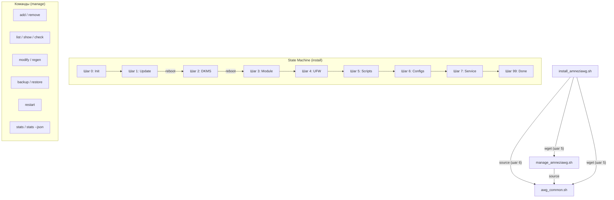

<p align="center">
  🇷🇺 <b>Русский</b> | 🇬🇧 <a href="ADVANCED.en.md">English</a>
</p>

# AmneziaWG 2.0 Installer: Дополнительная информация и настройки

Это дополнение к основному [README.md](README.md), содержащее более глубокие технические детали, пояснения и продвинутые опции для скриптов установки и управления AmneziaWG 2.0.

## Оглавление

<a id="toc-adv"></a>
- [✨ Возможности (Подробно)](#features-detailed-adv)
- [🔐 Параметры AWG 2.0](#awg2-params-adv)
- [⚙️ Детали конфигурации клиента](#config-details-adv)
  - [AllowedIPs](#allowedips-adv)
  - [PersistentKeepalive](#persistentkeepalive-adv)
  - [DNS](#dns-adv)
  - [Изменение настроек по умолчанию](#change-defaults-adv)
- [🔒 Настройки безопасности сервера](#security-adv)
  - [Фаервол UFW](#ufw-adv)
  - [Параметры ядра (Sysctl)](#sysctl-adv)
  - [Fail2Ban (Автоматическая установка)](#fail2ban-adv)
- [🧹 Оптимизация сервера](#optimization-adv)
- [📋 Примеры конфигурации](#config-examples-adv)
- [⚙️ CLI Параметры запуска скриптов](#cli-params-adv)
  - [install_amneziawg.sh](#install-cli-adv)
  - [manage_amneziawg.sh](#manage-cli-adv)
- [🧑‍💻 Полный список команд управления](#manage-commands-adv)
- [🛠️ Технические детали](#tech-details-adv)
  - [Архитектура скриптов](#architecture-adv)
  - [DKMS](#dkms-adv)
  - [Генерация ключей и конфигов](#keygen-adv)
- [🔄 Как обновить скрипты](#update-scripts-adv)
- [❓ FAQ (Дополнительные вопросы)](#faq-advanced-adv)
- [🩺 Диагностика и деинсталляция](#diag-uninstall-adv)
  - [Содержимое диагностического отчёта](#diagnostic-report-adv)
- [🔧 Устранение неполадок (подробно)](#troubleshooting-adv)
- [📊 Статистика трафика (stats)](#stats-adv)
- [⏳ Временные клиенты (--expires)](#expires-adv)
- [📱 vpn:// URI импорт](#vpnuri-adv)
- [🐧 Поддержка Debian](#debian-support-adv)
- [🤝 Внесение вклада (Contributing)](#contributing-adv)
- [💖 Благодарности](#thanks-adv)

---

<a id="features-detailed-adv"></a>
## ✨ Возможности (Подробно)

* **AmneziaWG 2.0:** Поддержка протокола нового поколения с расширенными параметрами обфускации (H1-H4 диапазоны, S3-S4, CPS I1).
* **Нативная генерация:** Ключи генерируются через `awg genkey/pubkey`, конфиги — через Bash-шаблоны, QR — через `qrencode`. Внешняя зависимость от Python/awgcfg.py полностью устранена.
* **Автоматическая установка:** Устанавливает AmneziaWG, DKMS модуль, зависимости, настраивает сеть, фаервол, sysctl.
* **Возобновляемость:** Использует файл состояния (`/root/awg/setup_state`) для продолжения после обязательных перезагрузок.
* **Оптимизация сервера:**
    * Удаление ненужных пакетов (snapd, modemmanager, и др.)
    * Hardware-aware настройка swap и сетевых буферов
    * Отключение NIC offloads (GRO/GSO/TSO) для оптимизации VPN
* **Безопасность по умолчанию:**
    * `UFW`: Политика `deny incoming`, лимит SSH, разрешение VPN-порта.
    * `IPv6`: По умолчанию предлагается отключить через `sysctl`.
    * `Права доступа`: Строгие права (600/700) на все ключи и конфиги.
    * `Sysctl`: BBR congestion control, защита от спуфинга, оптимизация TCP.
    * `Fail2Ban`: Автоматическая установка и настройка для SSH.
* **Резервное копирование:** Команда `backup` в скрипте управления (включая ключи клиентов).

---

<a id="awg2-params-adv"></a>
## 🔐 Параметры AWG 2.0

Все параметры генерируются автоматически при установке и сохраняются в `/root/awg/awgsetup_cfg.init`. Они одинаковы для сервера и всех клиентов.

| Параметр | Описание | Диапазон | Пример |
|----------|----------|----------|--------|
| `Jc` | Количество junk-пакетов | 4-8 | `6` |
| `Jmin` | Мин. размер junk (байт) | 40-89 | `55` |
| `Jmax` | Макс. размер junk (байт) | Jmin+100..Jmin+999 | `780` |
| `S1` | Padding init-сообщения (байт) | 15-150 | `72` |
| `S2` | Padding response-сообщения (байт) | 15-150, S1+56≠S2 | `56` |
| `S3` | Padding cookie-сообщения (байт) | 8-55 | `32` |
| `S4` | Padding data-сообщения (байт) | 4-27 | `16` |
| `H1` | Идентификатор init-сообщения | Диапазон uint32 | `134567-245678` |
| `H2` | Идентификатор response-сообщения | Диапазон uint32 | `3456789-4567890` |
| `H3` | Идентификатор cookie-сообщения | Диапазон uint32 | `56789012-67890123` |
| `H4` | Идентификатор data-сообщения | Диапазон uint32 | `456789012-567890123` |
| `I1` | CPS concealment packet | Формат `<r N>` | `<r 128>` |

**Критические ограничения:**
* H1-H4 диапазоны **не должны пересекаться** (гарантируется алгоритмом генерации).
* `S1 + 56 ≠ S2` — предотвращает одинаковый размер init и response сообщений.
* Все узлы (сервер + клиенты) **должны** использовать одинаковые параметры.

---

<a id="config-details-adv"></a>
## ⚙️ Детали конфигурации клиента

<a id="allowedips-adv"></a>
### AllowedIPs

Определяет, какой трафик **клиент** направляет в VPN-туннель.

1.  **Режим 1: Весь трафик (`0.0.0.0/0`)**
    * Весь IPv4 трафик клиента -> VPN.
    * Максимальная приватность. Может блокировать доступ к LAN.

2.  **Режим 2: Список Amnezia + DNS (По умолчанию)**
    * Список публичных IP-диапазонов + DNS `1.1.1.1`, `8.8.8.8`.
    * **Цель:** Обход DPI, туннелирование DNS. Рекомендуется.

3.  **Режим 3: Пользовательский (Split-Tunneling)**
    * Только трафик к указанным сетям -> VPN.
    * Пример: `192.168.1.0/24,10.50.0.0/16`

**Калькулятор AllowedIPs:** [WireGuard AllowedIPs Calculator](https://www.procustodibus.com/blog/2021/03/wireguard-allowedips-calculator/).

<a id="persistentkeepalive-adv"></a>
### PersistentKeepalive

* **Значение по умолчанию:** `33` секунды.
* Поддерживает UDP-сессию через NAT.
* **Изменение:** `sudo bash /root/awg/manage_amneziawg.sh modify <имя> PersistentKeepalive 25`

<a id="dns-adv"></a>
### DNS

* **Значение по умолчанию:** `1.1.1.1` (Cloudflare).
* DNS-сервер для клиента внутри VPN.
* **Изменение:** `sudo bash /root/awg/manage_amneziawg.sh modify <имя> DNS "8.8.8.8,1.0.0.1"`

<a id="change-defaults-adv"></a>
### Изменение настроек по умолчанию

Для изменения DNS или PersistentKeepalive по умолчанию для **новых** клиентов отредактируйте функцию `render_client_config()` в файле `awg_common.sh` **перед** первым запуском.

---

<a id="security-adv"></a>
## 🔒 Настройки безопасности сервера

<a id="ufw-adv"></a>
### Фаервол UFW

* **Политики:** Deny incoming, Allow outgoing.
* **Правила:** `limit 22/tcp` (SSH), `allow <порт_vpn>/udp`.
* **Проверка:** `sudo ufw status verbose`

<a id="sysctl-adv"></a>
### Параметры ядра (Sysctl)

Файл: `/etc/sysctl.d/99-amneziawg-security.conf`. Включает:
* IP forwarding
* IPv6 disable (опц.)
* BBR congestion control + FQ qdisc
* TCP hardening (syncookies, rp_filter, RFC1337)
* Отключение ICMP redirects и source routing
* Адаптивные сетевые буферы (rmem/wmem по объёму RAM)
* nf_conntrack_max = 65536
* kernel.sysrq = 0

<a id="fail2ban-adv"></a>
### Fail2Ban (Автоматическая установка)

* Автоматически устанавливается и настраивается для защиты SSH.
* **Настройки:** Бан через `ufw`, 5 попыток -> бан на 1 час.
* **Проверка:** `sudo fail2ban-client status sshd`.

---

<a id="optimization-adv"></a>
## 🧹 Оптимизация сервера

Скрипт установки автоматически оптимизирует сервер:

**Удаляемые пакеты:** `snapd`, `modemmanager`, `networkd-dispatcher`, `unattended-upgrades`, `packagekit`, `lxd-agent-loader`, `udisks2`. Cloud-init удаляется **только** если не управляет сетевой конфигурацией.

**Hardware-aware настройки:**
* **Swap:** 1 ГБ при RAM ≤ 2 ГБ, 512 МБ при RAM > 2 ГБ. `vm.swappiness = 10`.
* **NIC:** Отключение GRO/GSO/TSO (могут конфликтовать с VPN-трафиком).
* **Сетевые буферы:** Автоматическая настройка `rmem_max`/`wmem_max` в зависимости от объёма RAM.

---

<a id="config-examples-adv"></a>
## 📋 Примеры конфигурации

<details>
<summary><strong>awgsetup_cfg.init (параметры установки)</strong></summary>

```bash
# Конфигурация установки AmneziaWG 2.0 (Авто-генерация)
export AWG_PORT=39743
export AWG_TUNNEL_SUBNET='10.9.9.1/24'
export DISABLE_IPV6=1
export ALLOWED_IPS_MODE=2
export ALLOWED_IPS='0.0.0.0/5, 8.0.0.0/7, ...'
export AWG_ENDPOINT=''
export AWG_Jc=6
export AWG_Jmin=55
export AWG_Jmax=780
export AWG_S1=72
export AWG_S2=56
export AWG_S3=32
export AWG_S4=16
export AWG_H1='234567-345678'
export AWG_H2='3456789-4567890'
export AWG_H3='56789012-67890123'
export AWG_H4='456789012-567890123'
export AWG_I1='<r 128>'
```
</details>

<details>
<summary><strong>awg0.conf (серверный конфиг, ключи замаскированы)</strong></summary>

```ini
[Interface]
PrivateKey = [SERVER_PRIVATE_KEY]
Address = 10.9.9.1/24
ListenPort = 39743
PostUp = iptables -A FORWARD -i %i -j ACCEPT; iptables -t nat -A POSTROUTING -o eth0 -j MASQUERADE
PostDown = iptables -D FORWARD -i %i -j ACCEPT; iptables -t nat -D POSTROUTING -o eth0 -j MASQUERADE
Jc = 6
Jmin = 55
Jmax = 780
S1 = 72
S2 = 56
S3 = 32
S4 = 16
H1 = 234567-345678
H2 = 3456789-4567890
H3 = 56789012-67890123
H4 = 456789012-567890123
I1 = <r 128>

[Peer]
#_Name = my_phone
PublicKey = [CLIENT_PUBLIC_KEY]
AllowedIPs = 10.9.9.2/32
```
</details>

<details>
<summary><strong>client.conf (клиентский конфиг, ключи замаскированы)</strong></summary>

```ini
[Interface]
PrivateKey = [CLIENT_PRIVATE_KEY]
Address = 10.9.9.2/32
DNS = 1.1.1.1
Jc = 6
Jmin = 55
Jmax = 780
S1 = 72
S2 = 56
S3 = 32
S4 = 16
H1 = 234567-345678
H2 = 3456789-4567890
H3 = 56789012-67890123
H4 = 456789012-567890123
I1 = <r 128>

[Peer]
PublicKey = [SERVER_PUBLIC_KEY]
Endpoint = 203.0.113.1:39743
AllowedIPs = 0.0.0.0/5, 8.0.0.0/7, ...
PersistentKeepalive = 33
```
</details>

---

<a id="cli-params-adv"></a>
## 🖥️ CLI Параметры запуска скриптов

<a id="install-cli-adv"></a>
### install_amneziawg.sh (v5.6.0)

```
Опции:
  -h, --help            Показать справку
  --uninstall           Удалить AmneziaWG
  --diagnostic          Создать диагностический отчет
  -v, --verbose         Расширенный вывод (включая DEBUG)
  --no-color            Отключить цветной вывод
  --port=НОМЕР          Установить UDP порт (1024-65535)
  --subnet=ПОДСЕТЬ      Установить подсеть туннеля (x.x.x.x/yy)
  --allow-ipv6          Оставить IPv6 включенным
  --disallow-ipv6       Принудительно отключить IPv6
  --route-all           Режим: Весь трафик (0.0.0.0/0)
  --route-amnezia       Режим: Список Amnezia+DNS (умолч.)
  --route-custom=СЕТИ   Режим: Только указанные сети
  --endpoint=IP         Указать внешний IP (для серверов за NAT)
  -y, --yes             Неинтерактивный режим (все подтверждения auto-yes)
```

<a id="manage-cli-adv"></a>
### manage_amneziawg.sh (v5.6.0)

```
Опции:
  -h, --help            Показать справку
  -v, --verbose         Расширенный вывод (для list)
  --no-color            Отключить цветной вывод
  --conf-dir=ПУТЬ       Указать директорию AWG (умолч: /root/awg)
  --server-conf=ПУТЬ    Указать файл конфига сервера
  --json                JSON-вывод (для команды stats)
  --expires=ВРЕМЯ       Срок действия при add (1h, 12h, 1d, 7d, 30d, 4w)
```

---

<a id="manage-commands-adv"></a>
## 🧑‍💻 Полный список команд управления

Используйте `sudo bash /root/awg/manage_amneziawg.sh <команда>`:

* **`add <имя> [--expires=ВРЕМЯ]`:** Добавить клиента (генерация ключей, конфиг, QR-код, vpn:// URI, добавление пира). С `--expires` — клиент с ограниченным сроком.
* **`remove <имя>`:** Удалить клиента (конфиг, ключи, запись в серверном конфиге).
* **`list [-v]`:** Список клиентов (с деталями при `-v`).
* **`regen [имя]`:** Перегенерировать файлы `.conf`/`.png` для клиента или всех клиентов.
* **`modify <имя> <пар> <зн>`:** Изменить параметр клиента в `.conf` файле. Допустимые параметры: DNS, Endpoint, AllowedIPs, Address, PersistentKeepalive, MTU.
* **`backup`:** Создать резервную копию (конфиги + ключи).
* **`restore [файл]`:** Восстановить из резервной копии.
* **`check` / `status`:** Проверить состояние сервера (сервис, порт, AWG 2.0 параметры).
* **`show`:** Выполнить `awg show`.
* **`restart`:** Перезапустить сервис AmneziaWG.
* **`help`:** Показать справку.
* **`stats [--json]`:** Статистика трафика по клиентам. С `--json` — машиночитаемый формат для интеграции.

### Примеры использования

```bash
# Изменить DNS клиента
sudo bash /root/awg/manage_amneziawg.sh modify my_phone DNS "8.8.8.8,1.0.0.1"

# Изменить PersistentKeepalive
sudo bash /root/awg/manage_amneziawg.sh modify my_phone PersistentKeepalive 25

# Изменить AllowedIPs (split-tunneling)
sudo bash /root/awg/manage_amneziawg.sh modify my_phone AllowedIPs "192.168.1.0/24,10.0.0.0/8"

# Перегенерировать конфиг одного клиента
sudo bash /root/awg/manage_amneziawg.sh regen my_phone

# Создать бэкап
sudo bash /root/awg/manage_amneziawg.sh backup

# Восстановить из последнего бэкапа (интерактивный выбор)
sudo bash /root/awg/manage_amneziawg.sh restore
```

---

<a id="tech-details-adv"></a>
## 🛠️ Технические детали

<a id="architecture-adv"></a>
### Архитектура скриптов (v5.6.0)

| Файл | Назначение |
|------|-----------|
| `install_amneziawg.sh` | Установщик: state machine из 8 шагов с поддержкой resume |
| `manage_amneziawg.sh` | Управление: add/remove/list/regen/stats/backup/restore |
| `awg_common.sh` | Общая библиотека: ключи, конфиги, QR, peer management |
| `install_amneziawg_en.sh` | Установщик (English версия) |
| `manage_amneziawg_en.sh` | Управление (English версия) |
| `awg_common_en.sh` | Общая библиотека (English версия) |

`awg_common.sh` подключается через `source` из обоих скриптов. Установщик скачивает его на шаге 5.



<a id="dkms-adv"></a>
### DKMS

Обеспечивает пересборку модуля ядра `amneziawg` при обновлении ядра. Проверка: `dkms status`.

<a id="keygen-adv"></a>
### Генерация ключей и конфигов

**Полностью нативная** генерация:
* **Ключи:** `awg genkey` + `awg pubkey` (стандартные утилиты AmneziaWG).
* **Конфиги:** Bash-шаблоны с AWG 2.0 параметрами.
* **QR-коды:** `qrencode -t png`.
* **Python/awgcfg.py:** Убраны полностью. Workaround для бага удаления конфига больше не нужен.

Ключи клиентов хранятся в `/root/awg/keys/` (права 600). Серверные ключи — в `/root/awg/server_private.key` и `server_public.key`.

---

<a id="update-scripts-adv"></a>
## 🔄 Как обновить скрипты

Для обновления скриптов управления и общей библиотеки **без переустановки сервера**:

```bash
# Скачать обновлённые скрипты
wget -O /root/awg/manage_amneziawg.sh https://raw.githubusercontent.com/bivlked/amneziawg-installer/main/manage_amneziawg.sh
wget -O /root/awg/awg_common.sh https://raw.githubusercontent.com/bivlked/amneziawg-installer/main/awg_common.sh

# Установить права
chmod 700 /root/awg/manage_amneziawg.sh /root/awg/awg_common.sh
```

> **Примечание:** Переустановка скрипта `install_amneziawg.sh` **не требуется** для обновления управления. Переустановка нужна только при смене версии протокола.

---

<a id="faq-advanced-adv"></a>
## ❓ FAQ (Дополнительные вопросы)

<details>
  <summary><strong>В: Как изменить порт AmneziaWG после установки?</strong></summary>
  **О:** 1. Измените `ListenPort` в `/etc/amnezia/amneziawg/awg0.conf`. 2. Измените `AWG_PORT` в `/root/awg/awgsetup_cfg.init`. 3. Обновите UFW (`sudo ufw delete allow <старый_порт>/udp`, `sudo ufw allow <новый_порт>/udp`). 4. Перезапустите сервис (`sudo systemctl restart awg-quick@awg0`). 5. **Перегенерируйте конфиги ВСЕХ клиентов** (`sudo bash /root/awg/manage_amneziawg.sh regen`) и передайте их клиентам.
</details>

<details>
  <summary><strong>В: Как изменить внутреннюю подсеть VPN?</strong></summary>
  **О:** Проще всего выполнить деинсталляцию (`sudo bash ./install_amneziawg.sh --uninstall`) и установить заново, указав новую подсеть при первом запуске.
</details>

<details>
  <summary><strong>В: Как изменить MTU?</strong></summary>
  **О:** Добавьте строку `MTU = <значение>` (например, `MTU = 1420`) в секцию `[Interface]` файла `/etc/amnezia/amneziawg/awg0.conf` и в `.conf` файлы клиентов. Перезапустите сервис.
</details>

<details>
  <summary><strong>В: Где хранятся параметры AWG 2.0?</strong></summary>
  **О:** В файле `/root/awg/awgsetup_cfg.init` (переменные AWG_Jc, AWG_S1..S4, AWG_H1..H4, AWG_I1). Эти же параметры записываются в серверный и клиентские конфиги.
</details>

<details>
  <summary><strong>В: Можно ли изменить параметры AWG 2.0 после установки?</strong></summary>
  **О:** Не рекомендуется. Параметры должны быть одинаковыми на сервере и всех клиентах. При необходимости: 1) Остановите сервис. 2) Измените параметры в `awgsetup_cfg.init` и `awg0.conf`. 3) Перегенерируйте все клиентские конфиги (`manage regen`). 4) Запустите сервис. 5) Раздайте новые конфиги клиентам.
</details>

<details>
  <summary><strong>В: Сервер за NAT — как указать внешний IP?</strong></summary>
  **О:** Используйте флаг `--endpoint=<внешний_IP>` при установке: `sudo bash ./install_amneziawg.sh --endpoint=1.2.3.4`. Или укажите его позже через `sudo bash /root/awg/manage_amneziawg.sh regen` (скрипт попытается определить IP автоматически).
</details>

<details>
  <summary><strong>В: Как настроить проброс портов (NAT) для AmneziaWG?</strong></summary>
  **О:** Если сервер находится за NAT (например, в облаке с приватным IP): 1. Пробросьте UDP-порт AmneziaWG (по умолчанию 39743) на внешний IP. 2. При установке укажите внешний IP: <code>--endpoint=ВНЕШНИЙ_IP</code>. 3. Убедитесь, что фаервол провайдера разрешает входящий UDP на этот порт.
</details>

<details>
  <summary><strong>В: Как изменить DNS для всех существующих клиентов?</strong></summary>
  **О:** Используйте команду <code>modify</code> для каждого клиента: <code>sudo bash /root/awg/manage_amneziawg.sh modify &lt;имя&gt; DNS "8.8.8.8,1.0.0.1"</code>. Затем перегенерируйте конфиги: <code>sudo bash /root/awg/manage_amneziawg.sh regen</code>. Для изменения DNS по умолчанию для новых клиентов отредактируйте <code>awg_common.sh</code>.
</details>

<details>
  <summary><strong>В: Как мониторить трафик VPN?</strong></summary>
  **О:** 1. Текущие подключения: <code>sudo awg show</code>. 2. Статистика передачи: <code>sudo awg show awg0 transfer</code>. 3. Логи сервиса: <code>sudo journalctl -u awg-quick@awg0 -f</code>. 4. Общий статус: <code>sudo bash /root/awg/manage_amneziawg.sh check</code>.
</details>

<details>
  <summary><strong>В: Ошибка «Неверный ключ: s3» при импорте конфига в Windows-клиент?</strong></summary>
  <b>О:</b> Вы используете <code>amneziawg-windows-client</code> — standalone tunnel manager, который поддерживает только AWG 1.x и <b>не понимает</b> параметры AWG 2.0 (S3, S4, I1, диапазоны H1-H4). Установите полноценный клиент <a href="https://github.com/amnezia-vpn/amnezia-client/releases"><b>Amnezia VPN</b></a> версии <b>>= 4.8.12.7</b>. Конфиги, сгенерированные скриптом, полностью корректны — просто нужен правильный клиент.
</details>

<details>
  <summary><strong>В: Ошибка DKMS при обновлении ядра — что делать?</strong></summary>
  **О:** 1. Проверьте статус: <code>dkms status</code>. 2. Попробуйте пересобрать: <code>sudo dkms install amneziawg/$(dkms status | grep amneziawg | head -1 | awk -F'[,/ ]+' '{print $2}')</code>. 3. Убедитесь, что установлены заголовки ядра: <code>sudo apt install linux-headers-$(uname -r)</code>. 4. При неустранимой ошибке запустите диагностику: <code>sudo bash ./install_amneziawg.sh --diagnostic</code>.
</details>

<details>
  <summary><strong>В: Подробности миграции VPN на другой сервер?</strong></summary>
  **О:** 1. На старом сервере: <code>sudo bash /root/awg/manage_amneziawg.sh backup</code>. 2. Скопируйте архив: <code>scp root@старый_сервер:/root/awg/backups/*.tar.gz .</code>. 3. На новом сервере установите AmneziaWG. 4. Скопируйте бэкап: <code>scp *.tar.gz root@новый_сервер:/root/awg/</code>. 5. Восстановите: <code>sudo bash /root/awg/manage_amneziawg.sh restore /root/awg/backup.tar.gz</code>. 6. Перегенерируйте конфиги с новым IP: <code>sudo bash /root/awg/manage_amneziawg.sh regen</code>. 7. Раздайте новые конфиги клиентам.
</details>

<details>
  <summary><strong>В: Как ограничить скорость для клиентов?</strong></summary>
  **О:** AmneziaWG не имеет встроенного ограничения скорости. Для этого используйте <code>tc</code> (traffic control): <code>sudo tc qdisc add dev awg0 root tbf rate 100mbit burst 32kbit latency 400ms</code>. Это ограничит общую пропускную способность интерфейса. Для per-client лимитов потребуется более сложная настройка с <code>tc</code> и <code>iptables</code> (mark + class).
</details>

---

<a id="diag-uninstall-adv"></a>
## 🩺 Диагностика и деинсталляция

* **Диагностика:** `sudo bash /путь/к/install_amneziawg.sh --diagnostic`. Отчет (включая AWG 2.0 параметры) сохраняется в `/root/awg/diag_*.txt`.
* **Деинсталляция:** `sudo bash /путь/к/install_amneziawg.sh --uninstall`. Запросит подтверждение и предложит создать бэкап.

<a id="diagnostic-report-adv"></a>
### Содержимое диагностического отчёта

Отчёт (`--diagnostic`) включает следующие секции:

| Секция | Описание |
|--------|----------|
| OS | Версия Ubuntu и ядра |
| Hardware | RAM, CPU, Swap |
| Configuration | Содержимое `awgsetup_cfg.init` |
| Server Config | `awg0.conf` (приватный ключ скрыт) |
| Service Status | Статус systemd сервиса |
| AWG Status | Вывод `awg show` |
| Network | Интерфейсы, порты, маршруты |
| Firewall | Правила UFW |
| Journal | Последние 50 строк лога сервиса |
| DKMS | Статус модуля ядра |

---

<a id="troubleshooting-adv"></a>
## 🔧 Устранение неполадок (подробно)

<details>
<summary><strong>Нет интернета после подключения к VPN</strong></summary>

1. Проверьте IP forwarding: `sysctl net.ipv4.ip_forward` (должно быть 1)
2. Проверьте NAT правила: `iptables -t nat -L POSTROUTING -v`
3. Проверьте AllowedIPs клиента (режим маршрутизации)
4. Проверьте DNS: `nslookup google.com` из VPN
5. Проверьте MTU: `ping -s 1280 -M do <IP_сервера>` — если не проходит, уменьшите MTU
</details>

<details>
<summary><strong>Handshake есть, но трафик не идёт</strong></summary>

1. Проверьте MTU: добавьте `MTU = 1280` в `[Interface]` серверного и клиентского конфигов
2. Проверьте iptables: `iptables -L FORWARD -v` — должно быть правило ACCEPT для awg0
3. Проверьте NIC: `ip route get 1.1.1.1` — убедитесь, что PostUp/PostDown используют правильный интерфейс
</details>

<details>
<summary><strong>Порт занят другим процессом</strong></summary>

1. Определите процесс: `ss -lunp | grep :<порт>`
2. Измените порт AmneziaWG или остановите конфликтующий сервис
3. Для смены порта см. FAQ "Как изменить порт"
</details>

---

<a id="stats-adv"></a>
## 📊 Статистика трафика (stats)

Команда `stats` показывает статистику трафика для каждого клиента.

**Обычный вывод:**

```bash
sudo bash /root/awg/manage_amneziawg.sh stats
```

```
Клиент          Получено        Отправлено      Последний handshake
───────────────────────────────────────────────────────────────────
my_phone        1.24 GiB        356.7 MiB       2 minutes ago
laptop          892.3 MiB       128.4 MiB       15 seconds ago
guest           0 B             0 B             (none)
```

**JSON-вывод:**

```bash
sudo bash /root/awg/manage_amneziawg.sh stats --json
```

```json
[
  {
    "name": "my_phone",
    "public_key": "abc123...",
    "received_bytes": 1332477952,
    "sent_bytes": 374083174,
    "latest_handshake": 1710312180
  }
]
```

---

<a id="expires-adv"></a>
## ⏳ Временные клиенты (--expires)

Создание клиентов с автоматическим удалением по истечении срока.

**Создание:**

```bash
sudo bash /root/awg/manage_amneziawg.sh add guest --expires=7d
```

**Форматы длительности:**

| Формат | Описание |
|--------|----------|
| `1h` | 1 час |
| `12h` | 12 часов |
| `1d` | 1 день |
| `7d` | 7 дней |
| `30d` | 30 дней |
| `4w` | 4 недели |

**Механизм работы:**

1. При создании клиента с `--expires` сохраняется timestamp истечения в `/root/awg/expiry/<имя>`.
2. Cron-задача `/etc/cron.d/awg-expiry` проверяет каждые 5 минут.
3. Истёкшие клиенты автоматически удаляются (конфиг, ключи, запись в серверном конфиге).
4. При удалении последнего expiry-клиента cron-задача автоматически удаляется.

**Проверка:** `list -v` показывает оставшееся время для каждого клиента с истечением.

---

<a id="vpnuri-adv"></a>
## 📱 vpn:// URI импорт

При создании клиента автоматически генерируется `.vpnuri` файл с `vpn://` URI для быстрого импорта в Amnezia Client.

**Расположение файлов:** `/root/awg/<имя_клиента>.vpnuri`

**Формат:** Конфигурация сжимается через zlib (Perl `Compress::Zlib`) и кодируется в Base64, формируя URI вида `vpn://...`.

**Использование в Amnezia Client:**

1. Скопируйте содержимое `.vpnuri` файла
2. Откройте Amnezia Client
3. «Добавить VPN» → «Вставить из буфера»
4. Конфигурация импортируется автоматически

**Права доступа:** Файлы `.vpnuri` имеют права 600 (только root).

---

<a id="debian-support-adv"></a>
## 🐧 Поддержка Debian

Начиная с v5.6.0, инсталлятор полностью поддерживает Debian 12 (bookworm) и Debian 13 (trixie).

**Различия Ubuntu vs Debian:**

| Аспект | Ubuntu 24.04 | Debian 12 (bookworm) | Debian 13 (trixie) |
|--------|-------------|---------------------|-------------------|
| PPA codename | native | маппинг на `focal` | маппинг на `noble` |
| APT формат | `.list` | `.list` | DEB822 `.sources` |
| Headers | `linux-headers-$(uname -r)` | fallback на `linux-headers-amd64` | fallback на `linux-headers-amd64` |
| deb-src | Да | Нет | Нет |
| snapd/lxd cleanup | Да | Пропускается | Пропускается |

**Предварительная подготовка Debian:**

На минимальных установках Debian отсутствует `curl`:

```bash
apt-get update && apt-get install -y curl
```

**Ожидаемые предупреждения:**

При установке на Debian вы можете увидеть предупреждение `sudo removal refused` — это нормально, так как Debian использует `sudo` как системный пакет и скрипт корректно пропускает его удаление.

---

<a id="contributing-adv"></a>
## 🤝 Внесение вклада (Contributing)

Предложения и исправления приветствуются! Создавайте Issue или Pull Request в [репозитории](https://github.com/bivlked/amneziawg-installer).

---

<a id="thanks-adv"></a>
## 💖 Благодарности

* Команде [Amnezia VPN](https://github.com/amnezia-vpn).

---

<p align="center">
  <a href="#amneziawg-20-installer-дополнительная-информация-и-настройки">↑ К началу</a>
</p>
