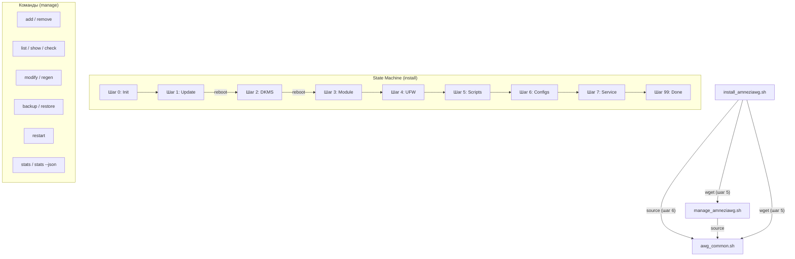

<p align="center">
  <b>RU</b> Русский | <b>EN</b> <a href="ADVANCED.en.md">English</a>
</p>

# AmneziaWG 2.0 Installer: Дополнительная информация и настройки

Это дополнение к основному [README.md](README.md), содержащее более глубокие технические детали, пояснения и продвинутые опции для скриптов установки и управления AmneziaWG 2.0.

## Оглавление

<a id="toc-adv"></a>
- [✨ Возможности (Подробно)](#features-detailed-adv)
- [🔐 Параметры AWG 2.0](#awg2-params-adv)
  - [Presets (v5.10.0+)](#presets-adv)
- [⚙️ Детали конфигурации клиента](#config-details-adv)
  - [AllowedIPs](#allowedips-adv)
  - [PersistentKeepalive](#persistentkeepalive-adv)
  - [DNS](#dns-adv)
  - [Изменение настроек по умолчанию](#change-defaults-adv)
- [🔒 Настройки безопасности сервера](#security-adv)
  - [Фаервол UFW](#ufw-adv)
  - [Параметры ядра (Sysctl)](#sysctl-adv)
  - [Fail2Ban (Автоматическая установка)](#fail2ban-adv)
- [🧹 Оптимизация сервера](#optimization-adv)
- [📋 Примеры конфигурации](#config-examples-adv)
- [⚙️ CLI Параметры запуска скриптов](#cli-params-adv)
  - [install_amneziawg.sh](#install-cli-adv)
  - [manage_amneziawg.sh](#manage-cli-adv)
- [🧑‍💻 Полный список команд управления](#manage-commands-adv)
- [🛠️ Технические детали](#tech-details-adv)
  - [Архитектура скриптов](#architecture-adv)
  - [DKMS](#dkms-adv)
  - [Генерация ключей и конфигов](#keygen-adv)
- [🔄 Как обновить скрипты](#update-scripts-adv)
- [❓ FAQ (Дополнительные вопросы)](#faq-advanced-adv)
- [🩺 Диагностика и деинсталляция](#diag-uninstall-adv)
  - [Содержимое диагностического отчёта](#diagnostic-report-adv)
- [🔧 Устранение неполадок (подробно)](#troubleshooting-adv)
- [📊 Статистика трафика (stats)](#stats-adv)
- [⏳ Временные клиенты (--expires)](#expires-adv)
- [📱 vpn:// URI импорт](#vpnuri-adv)
- [📱 MTU и мобильные клиенты](#mtu-mobile-adv)
- [📋 Совместимость клиентов AWG 2.0](#client-compat-adv)
- [🐧 Поддержка Debian](#debian-support-adv)
- [🔧 Raspberry Pi и ARM64](#arm-support-adv)
- [📦 LXC / Docker через amneziawg-go (userspace)](#lxc-userspace-adv)
- [⚠️ Известные ограничения](#limitations-adv)
- [🤝 Внесение вклада (Contributing)](#contributing-adv)
- [💖 Благодарности](#thanks-adv)

---

> История изменений по версиям: [CHANGELOG.md](CHANGELOG.md)

---

<a id="features-detailed-adv"></a>
## ✨ Возможности (Подробно)

* **AmneziaWG 2.0:** Поддержка протокола нового поколения с расширенными параметрами обфускации (H1-H4 диапазоны, S3-S4, CPS I1).
* **Нативная генерация:** Ключи генерируются через `awg genkey/pubkey`, конфиги — через Bash-шаблоны, QR — через `qrencode`. Внешняя зависимость от Python/awgcfg.py полностью устранена.
* **Автоматическая установка:** Устанавливает AmneziaWG, DKMS модуль, зависимости, настраивает сеть, фаервол, sysctl.
* **Возобновляемость:** Использует файл состояния (`/root/awg/setup_state`) для продолжения после обязательных перезагрузок.
* **Оптимизация сервера:**
    * Удаление ненужных пакетов (snapd, modemmanager, и др.)
    * Hardware-aware настройка swap и сетевых буферов
    * Отключение NIC offloads (GRO/GSO/TSO) для оптимизации VPN
* **Безопасность по умолчанию:**
    * `UFW`: Политика `deny incoming`, лимит SSH, разрешение VPN-порта.
    * `IPv6`: По умолчанию предлагается отключить через `sysctl`.
    * `Права доступа`: Строгие права (600/700) на все ключи и конфиги.
    * `Sysctl`: BBR congestion control, защита от спуфинга, оптимизация TCP.
    * `Fail2Ban`: Автоматическая установка и настройка для SSH.
* **Резервное копирование:** Команда `backup` в скрипте управления (включая ключи клиентов).

---

<a id="awg2-params-adv"></a>
## 🔐 Параметры AWG 2.0

Все параметры генерируются автоматически при установке и сохраняются в `/root/awg/awgsetup_cfg.init`. Они одинаковы для сервера и всех клиентов.

| Параметр | Описание | Диапазон | Пример |
|----------|----------|----------|--------|
| `Jc` | Количество junk-пакетов | 3-6 | `5` |
| `Jmin` | Мин. размер junk (байт) | 40-89 | `55` |
| `Jmax` | Макс. размер junk (байт) | Jmin+50..Jmin+250 | `200` |
| `S1` | Padding init-сообщения (байт) | 15-150 | `72` |
| `S2` | Padding response-сообщения (байт) | 15-150, S1+56≠S2 | `56` |
| `S3` | Padding cookie-сообщения (байт) | 8-55 | `32` |
| `S4` | Padding data-сообщения (байт) | 4-27 | `16` |
| `H1` | Идентификатор init-сообщения | Диапазон uint32 | `134567-245678` |
| `H2` | Идентификатор response-сообщения | Диапазон uint32 | `3456789-4567890` |
| `H3` | Идентификатор cookie-сообщения | Диапазон uint32 | `56789012-67890123` |
| `H4` | Идентификатор data-сообщения | Диапазон uint32 | `456789012-567890123` |
| `I1` | CPS concealment packet | Формат `<r N>` | `<r 128>` |

**Критические ограничения:**
* H1-H4 диапазоны **не должны пересекаться** (гарантируется алгоритмом генерации).
* `S1 + 56 ≠ S2` — предотвращает одинаковый размер init и response сообщений.
* Все узлы (сервер + клиенты) **должны** использовать одинаковые параметры.

<a id="presets-adv"></a>
### Presets (v5.10.0+)

Presets — это готовые наборы параметров обфускации, оптимизированные для конкретных условий сети. Выбираются при установке через флаг `--preset`.

| Preset | Jc | Jmin | Jmax | Когда использовать |
|--------|-----|------|------|-------------------|
| `default` | 3-6 (случайно) | 40-89 | Jmin + 50..250 | Домашний и проводной интернет, стандартные VPS |
| `mobile` | **3** (фиксированный) | 30-50 | Jmin + 20..80 | Мобильные операторы (Tele2, Yota, Мегафон, Таттелеком) |

**Установка с preset:**

```bash
# Стандартный профиль (по умолчанию)
sudo bash install_amneziawg.sh --yes --route-amnezia

# Мобильный профиль — для SIM-карт, LTE/5G модемов, мобильных роутеров
sudo bash install_amneziawg.sh --preset=mobile --yes --route-amnezia
```

**Точечные переопределения (`--jc`, `--jmin`, `--jmax`):**

Можно переопределить отдельные параметры поверх любого preset:

```bash
# Mobile preset, но Jc=4 вместо 3
sudo bash install_amneziawg.sh --preset=mobile --jc=4 --yes --route-amnezia

# Полностью ручные параметры
sudo bash install_amneziawg.sh --jc=2 --jmin=20 --jmax=60 --yes --route-amnezia
```

| Флаг | Диапазон | Описание |
|------|---------|----------|
| `--jc=N` | 1-128 | Количество junk-пакетов |
| `--jmin=N` | 0-1280 | Минимальный размер junk (байт) |
| `--jmax=N` | 0-1280 | Максимальный размер junk (байт), должен быть ≥ Jmin |

> **Совет:** Если VPN работает на домашнем Wi-Fi, но нестабилен через мобильную сеть — переустановите с `--preset=mobile`. Подробнее о проблемах мобильных операторов — в <a href="#faq-advanced-adv">FAQ</a>.

---

<a id="config-details-adv"></a>
## ⚙️ Детали конфигурации клиента

<a id="allowedips-adv"></a>
### AllowedIPs

Определяет, какой трафик **клиент** направляет в VPN-туннель.

1.  **Режим 1: Весь трафик (`0.0.0.0/0`)**
    * Весь IPv4 трафик клиента -> VPN.
    * Максимальная приватность. Может блокировать доступ к LAN.

2.  **Режим 2: Список Amnezia + DNS (По умолчанию)**
    * Список публичных IP-диапазонов + DNS `1.1.1.1`, `8.8.8.8`.
    * **Цель:** Обход DPI, туннелирование DNS. Рекомендуется.

3.  **Режим 3: Пользовательский (Split-Tunneling)**
    * Только трафик к указанным сетям -> VPN.
    * Пример: `192.168.1.0/24,10.50.0.0/16`

**Калькулятор AllowedIPs:** [WireGuard AllowedIPs Calculator](https://www.procustodibus.com/blog/2021/03/wireguard-allowedips-calculator/).

<a id="persistentkeepalive-adv"></a>
### PersistentKeepalive

* **Значение по умолчанию:** `33` секунды.
* Поддерживает UDP-сессию через NAT.
* **Изменение:** `sudo bash /root/awg/manage_amneziawg.sh modify <имя> PersistentKeepalive 25`

<a id="dns-adv"></a>
### DNS

* **Значение по умолчанию:** `1.1.1.1` (Cloudflare).
* DNS-сервер для клиента внутри VPN.
* **Изменение:** `sudo bash /root/awg/manage_amneziawg.sh modify <имя> DNS "8.8.8.8,1.0.0.1"`

<a id="change-defaults-adv"></a>
### Изменение настроек по умолчанию

Для изменения DNS или PersistentKeepalive по умолчанию для **новых** клиентов отредактируйте функцию `render_client_config()` в файле `awg_common.sh` **перед** первым запуском.

---

<a id="security-adv"></a>
## 🔒 Настройки безопасности сервера

<a id="ufw-adv"></a>
### Фаервол UFW

* **Политики:** Deny incoming, Allow outgoing, Deny routed.
* **Правила:** `limit 22/tcp` (SSH), `allow <порт_vpn>/udp`, `route allow in on awg0 out on <nic>` (маршрутизация VPN-трафика, добавлено в v5.7.6).
* **Проверка:** `sudo ufw status verbose`

<a id="sysctl-adv"></a>
### Параметры ядра (Sysctl)

Файл: `/etc/sysctl.d/99-amneziawg-security.conf`. Включает:
* IP forwarding
* IPv6 disable (опц.)
* BBR congestion control + FQ qdisc
* TCP hardening (syncookies, rp_filter, RFC1337)
* Отключение ICMP redirects и source routing
* Адаптивные сетевые буферы (rmem/wmem по объёму RAM)
* nf_conntrack_max = 65536
* kernel.sysrq = 0

<a id="fail2ban-adv"></a>
### Fail2Ban (Автоматическая установка)

* Автоматически устанавливается и настраивается для защиты SSH.
* **Настройки:** Бан через `ufw`, 5 попыток -> бан на 1 час.
* **Debian:** Автоматически используется `backend = systemd` (journald). На Ubuntu — `backend = auto`.
* **Проверка:** `sudo fail2ban-client status sshd`.

#### Безопасная загрузка конфигурации (v5.7.2)

Начиная с v5.7.2, файл параметров `awgsetup_cfg.init` загружается через `safe_load_config()` — whitelist-парсер, который принимает только заранее определённые ключи (`AWG_*`, `OS_*`, `DISABLE_IPV6`, `ALLOWED_IPS_*`, `NO_TWEAKS` и др.). Прежний метод через `source` заменён полностью. Парсер корректно обрабатывает значения как в одинарных, так и в двойных кавычках (`'value'` или `"value"`).

Это защищает от потенциальной инъекции кода: даже если файл конфигурации будет модифицирован, произвольные команды не выполнятся.

---

<a id="optimization-adv"></a>
## 🧹 Оптимизация сервера

Скрипт установки автоматически оптимизирует сервер:

**Удаляемые пакеты:** `snapd`, `modemmanager`, `networkd-dispatcher`, `unattended-upgrades`, `packagekit`, `lxd-agent-loader`, `udisks2`. Cloud-init удаляется **только** если не управляет сетевой конфигурацией.

**Hardware-aware настройки:**
* **Swap:** 1 ГБ при RAM ≤ 2 ГБ, 512 МБ при RAM > 2 ГБ. `vm.swappiness = 10`.
* **NIC:** Отключение GRO/GSO/TSO (могут конфликтовать с VPN-трафиком).
* **Сетевые буферы:** Автоматическая настройка `rmem_max`/`wmem_max` в зависимости от объёма RAM.

---

<a id="config-examples-adv"></a>
## 📋 Примеры конфигурации

<details>
<summary><strong>awgsetup_cfg.init (параметры установки)</strong></summary>

```bash
# Конфигурация установки AmneziaWG 2.0 (Авто-генерация)
export AWG_PORT=39743
export AWG_TUNNEL_SUBNET='10.9.9.1/24'
export DISABLE_IPV6=1
export ALLOWED_IPS_MODE=2
export ALLOWED_IPS='0.0.0.0/5, 8.0.0.0/7, ...'
export AWG_ENDPOINT=''
export AWG_Jc=6
export AWG_Jmin=55
export AWG_Jmax=205
export AWG_S1=72
export AWG_S2=56
export AWG_S3=32
export AWG_S4=16
export AWG_H1='234567-345678'
export AWG_H2='3456789-4567890'
export AWG_H3='56789012-67890123'
export AWG_H4='456789012-567890123'
export AWG_I1='<r 128>'
export AWG_PRESET='default'
```
</details>

<details>
<summary><strong>awg0.conf (серверный конфиг, ключи замаскированы)</strong></summary>

```ini
[Interface]
PrivateKey = [SERVER_PRIVATE_KEY]
Address = 10.9.9.1/24
MTU = 1280
ListenPort = 39743
PostUp = iptables -I FORWARD -i %i -j ACCEPT; iptables -t nat -A POSTROUTING -o eth0 -j MASQUERADE
PostDown = iptables -D FORWARD -i %i -j ACCEPT; iptables -t nat -D POSTROUTING -o eth0 -j MASQUERADE
Jc = 6
Jmin = 55
Jmax = 205
S1 = 72
S2 = 56
S3 = 32
S4 = 16
H1 = 234567-345678
H2 = 3456789-4567890
H3 = 56789012-67890123
H4 = 456789012-567890123
I1 = <r 128>

[Peer]
#_Name = my_phone
PublicKey = [CLIENT_PUBLIC_KEY]
AllowedIPs = 10.9.9.2/32
```
</details>

<details>
<summary><strong>Минимальный awg0.conf для AWG 2.0 (если настраивается вручную)</strong></summary>

Если разворачиваете сервер не моим инсталлятором (например, `amneziawg-go` в LXC), минимальный валидный `awg0.conf` для AWG 2.0 выглядит так — все 11 обфускационных параметров обязательны, `manage_amneziawg.sh add/regen` упадёт с ошибкой если хотя бы один отсутствует:

```ini
[Interface]
PrivateKey = [SERVER_PRIVATE_KEY]
Address = 10.9.9.1/24
ListenPort = 51820
Jc = 4
Jmin = 40
Jmax = 90
S1 = 50
S2 = 40
S3 = 12
S4 = 8
H1 = 1234567
H2 = 2345678
H3 = 3456789
H4 = 4567890
```

Нюансы для ручной установки:

- **S3/S4** — параметры AWG 2.0, добавлены в протокол позже S1/S2. В конфигах от предыдущих версий (AWG 1.x) их может не быть — надо дописать руками, значения любые в диапазоне 0-127, главное что вообще есть.
- **H1–H4** могут быть single-value (`H1 = 1234567`) или range (`H1 = 100000-200000`), диапазоны не должны пересекаться. Безопасный верхний предел — 2147483647 (`INT32_MAX`), иначе `amneziawg-windows-client` может подсвечивать значения как invalid.
- **I1** (CPS-пакеты) опционален: без него AWG-клиент работает в AWG 1.0 fallback режиме. Для полной AWG 2.0 обфускации — добавить `I1 = <r 128>` (random 128 байт) или `I1 = <b 0xHEX>` (binary).
- **MTU**, **PostUp/PostDown** — опциональны, зависят от сетапа (см. `amneziawg-go` секцию про iptables MASQUERADE в LXC).

После создания такого `awg0.conf` `manage_amneziawg.sh` требует ещё два файла: `/root/awg/server_public.key` (вычисляется: `awg pubkey < /etc/amnezia/amneziawg/server_private.key > /root/awg/server_public.key`) и минимальный `/root/awg/awgsetup_cfg.init` с `AWG_PORT`, `AWG_TUNNEL_SUBNET`, `AWG_ENDPOINT`.

</details>

<details>
<summary><strong>client.conf (клиентский конфиг, ключи замаскированы)</strong></summary>

```ini
[Interface]
PrivateKey = [CLIENT_PRIVATE_KEY]
Address = 10.9.9.2/32
DNS = 1.1.1.1
MTU = 1280
Jc = 6
Jmin = 55
Jmax = 205
S1 = 72
S2 = 56
S3 = 32
S4 = 16
H1 = 234567-345678
H2 = 3456789-4567890
H3 = 56789012-67890123
H4 = 456789012-567890123
I1 = <r 128>

[Peer]
PublicKey = [SERVER_PUBLIC_KEY]
Endpoint = 203.0.113.1:39743
AllowedIPs = 0.0.0.0/5, 8.0.0.0/7, ...
PersistentKeepalive = 33
```
</details>

---

<a id="cli-params-adv"></a>
## 🖥️ CLI Параметры запуска скриптов

<a id="install-cli-adv"></a>
### install_amneziawg.sh

```
Опции:
  -h, --help            Показать справку
  --uninstall           Удалить AmneziaWG
  --diagnostic          Создать диагностический отчет
  -v, --verbose         Расширенный вывод (включая DEBUG)
  --no-color            Отключить цветной вывод
  --port=НОМЕР          Установить UDP порт (1024-65535)
  --subnet=ПОДСЕТЬ      Установить подсеть туннеля (x.x.x.x/yy)
  --allow-ipv6          Оставить IPv6 включенным
  --disallow-ipv6       Принудительно отключить IPv6
  --route-all           Режим: Весь трафик (0.0.0.0/0)
  --route-amnezia       Режим: Список Amnezia+DNS (умолч.)
  --route-custom=СЕТИ   Режим: Только указанные сети
  --endpoint=IP         Указать внешний IP (для серверов за NAT)
  --preset=ТИП          Набор параметров обфускации: default, mobile
                        mobile: Jc=3, узкий Jmax — для мобильных операторов (Tele2, Yota, Мегафон)
  --jc=N                Задать Jc вручную (1-128, поверх preset)
  --jmin=N              Задать Jmin вручную (0-1280, поверх preset)
  --jmax=N              Задать Jmax вручную (0-1280, поверх preset, ≥ Jmin)
  -y, --yes             Неинтерактивный режим (все подтверждения auto-yes)
  --no-tweaks           Пропустить hardening/оптимизацию (без UFW, Fail2Ban, sysctl tweaks)
```

<a id="manage-cli-adv"></a>
### manage_amneziawg.sh

```
Опции:
  -h, --help            Показать справку
  -v, --verbose         Расширенный вывод (для list)
  --no-color            Отключить цветной вывод
  --conf-dir=ПУТЬ       Указать директорию AWG (умолч: /root/awg)
  --server-conf=ПУТЬ    Указать файл конфига сервера
  --json                JSON-вывод (для команды stats)
  --expires=ВРЕМЯ       Срок действия при add (1h, 12h, 1d, 7d, 30d, 4w)
  --apply-mode=РЕЖИМ    syncconf (умолч.) или restart (обход kernel panic)
  --psk                 (только для add) сгенерировать PresharedKey для клиента (v5.11.1+)
```

> **`--psk`** — опциональный дополнительный слой поверх AWG 2.0 обфускации. Генерирует 32-байт симметричный ключ через `awg genpsk`, пишет его в серверный `[Peer]` и в клиентский `[Peer]` (`PresharedKey = ...`). Совместим с любым WireGuard/AmneziaWG клиентом. В batch-режиме `add c1 c2 c3 --psk` каждому клиенту выдаётся свой PSK. Без флага клиенты создаются без `PresharedKey` (default — AWG 2.0 обфускации достаточно для большинства сценариев). Флаг влияет только на новых клиентов, создаваемых этим вызовом `add` — существующие клиенты без PSK остаются без изменений и продолжают подключаться как раньше.

**Переменные среды:**

| Переменная | Описание |
|------------|----------|
| `AWG_SKIP_APPLY=1` | Пропустить apply_config. Для автоматизации: накопить N операций, применить одной командой |
| `AWG_APPLY_MODE=restart` | Полный перезапуск вместо syncconf (можно сохранить в `awgsetup_cfg.init`) |

---

<a id="manage-commands-adv"></a>
## 🧑‍💻 Полный список команд управления

Используйте `sudo bash /root/awg/manage_amneziawg.sh <команда>`:

> **Как `manage` находит клиентов в серверном конфиге.** Каждый `[Peer]`, созданный моим инсталлятором/`manage add`, содержит комментарий-маркер `#_Name = <имя>` на первой строке блока. Именно по нему `list`, `remove`, `regen`, `modify` находят нужного клиента. Если вы переносите `awg0.conf` со старого сервера или добавляете peer руками — дописывайте `#_Name = <имя>` после `[Peer]`, иначе `manage` не увидит такого клиента. Пример: блок `[Peer]` в серверном конфиге выше (см. [Примеры конфигурации](#config-examples-adv)).

* **`add <имя> [имя2 ...] [--expires=ВРЕМЯ] [--psk]`:** Добавить одного или нескольких клиентов. При batch-создании `awg syncconf` вызывается один раз для всех. С `--expires` — срок действия применяется ко всем. С `--psk` — для каждого генерируется отдельный PresharedKey (v5.11.1+).
* **`remove <имя> [имя2 ...]`:** Удалить одного или нескольких клиентов. При batch-удалении apply_config вызывается один раз.
* **`list [-v]`:** Список клиентов (с деталями при `-v`).
* **`regen [имя]`:** Перегенерировать файлы `.conf`/`.png` для клиента или всех клиентов.
* **`modify <имя> <пар> <зн>`:** Изменить параметр клиента в `.conf` файле. Допустимые параметры: DNS, Endpoint, AllowedIPs, PersistentKeepalive. После изменения QR-код и vpn:// URI автоматически перегенерируются.
* **`backup`:** Создать резервную копию (конфиги + ключи + данные истечения клиентов + cron).
* **`restore [файл]`:** Восстановить из резервной копии (включая данные истечения и cron-задачу).
* **`check` / `status`:** Проверить состояние сервера (сервис, порт, AWG 2.0 параметры).
* **`show`:** Выполнить `awg show`.
* **`restart`:** Перезапустить сервис AmneziaWG.
* **`help`:** Показать справку.
* **`stats [--json]`:** Статистика трафика по клиентам. С `--json` — машиночитаемый формат для интеграции.

### Примеры использования

```bash
# Изменить DNS клиента
sudo bash /root/awg/manage_amneziawg.sh modify my_phone DNS "8.8.8.8,1.0.0.1"

# Изменить PersistentKeepalive
sudo bash /root/awg/manage_amneziawg.sh modify my_phone PersistentKeepalive 25

# Изменить AllowedIPs (split-tunneling)
sudo bash /root/awg/manage_amneziawg.sh modify my_phone AllowedIPs "192.168.1.0/24,10.0.0.0/8"

# Перегенерировать конфиг одного клиента
sudo bash /root/awg/manage_amneziawg.sh regen my_phone

# Создать бэкап
sudo bash /root/awg/manage_amneziawg.sh backup

# Восстановить из последнего бэкапа (интерактивный выбор)
sudo bash /root/awg/manage_amneziawg.sh restore
```

---

<a id="tech-details-adv"></a>
## 🛠️ Технические детали

<a id="architecture-adv"></a>
### Архитектура скриптов

| Файл | Назначение |
|------|-----------|
| `install_amneziawg.sh` | Установщик: state machine из 8 шагов с поддержкой resume |
| `manage_amneziawg.sh` | Управление: add/remove/list/regen/stats/backup/restore |
| `awg_common.sh` | Общая библиотека: ключи, конфиги, QR, peer management |
| `install_amneziawg_en.sh` | Установщик (English версия) |
| `manage_amneziawg_en.sh` | Управление (English версия) |
| `awg_common_en.sh` | Общая библиотека (English версия) |

`awg_common.sh` подключается через `source` из обоих скриптов. Установщик скачивает его на шаге 5.



<a id="dkms-adv"></a>
### DKMS

Обеспечивает пересборку модуля ядра `amneziawg` при обновлении ядра. Проверка: `dkms status`.

<a id="keygen-adv"></a>
### Генерация ключей и конфигов

**Полностью нативная** генерация:
* **Ключи:** `awg genkey` + `awg pubkey` (стандартные утилиты AmneziaWG).
* **Конфиги:** Bash-шаблоны с AWG 2.0 параметрами.
* **QR-коды:** `qrencode -t png`.
* **Python/awgcfg.py:** Убраны полностью. Workaround для бага удаления конфига больше не нужен.

Ключи клиентов хранятся в `/root/awg/keys/` (права 600). Серверные ключи — в `/root/awg/server_private.key` и `server_public.key`.

#### Привязка URL к версии (v5.7.2)

Инсталлятор скачивает `awg_common.sh` и `manage_amneziawg.sh` с URL, привязанных к конкретному тегу версии:

```
https://raw.githubusercontent.com/bivlked/amneziawg-installer/v5.11.1/awg_common.sh
```

Это обеспечивает **supply chain pinning** — гарантию, что скачиваемые скрипты соответствуют версии инсталлятора, даже если `main` уже обновлён.

Для разработки можно переопределить ветку:

```bash
AWG_BRANCH=my-feature-branch sudo bash ./install_amneziawg.sh
```

---

<a id="update-scripts-adv"></a>
## 🔄 Как обновить скрипты

Для обновления скриптов управления и общей библиотеки **без переустановки сервера**:

```bash
# Русская версия:
wget -O /root/awg/manage_amneziawg.sh https://raw.githubusercontent.com/bivlked/amneziawg-installer/v5.11.1/manage_amneziawg.sh
wget -O /root/awg/awg_common.sh https://raw.githubusercontent.com/bivlked/amneziawg-installer/v5.11.1/awg_common.sh

# Английская версия:
wget -O /root/awg/manage_amneziawg.sh https://raw.githubusercontent.com/bivlked/amneziawg-installer/v5.11.1/manage_amneziawg_en.sh
wget -O /root/awg/awg_common.sh https://raw.githubusercontent.com/bivlked/amneziawg-installer/v5.11.1/awg_common_en.sh

# Установить права
chmod 700 /root/awg/manage_amneziawg.sh /root/awg/awg_common.sh
```

> **Примечание:** Переустановка скрипта `install_amneziawg.sh` **не требуется** для обновления управления. Переустановка нужна только при смене версии протокола.

---

<a id="faq-advanced-adv"></a>
## ❓ FAQ (Дополнительные вопросы)

<details>
  <summary><strong>В: Как изменить порт AmneziaWG после установки?</strong></summary>
  **О:** 1. Измените `ListenPort` в `/etc/amnezia/amneziawg/awg0.conf`. 2. Измените `AWG_PORT` в `/root/awg/awgsetup_cfg.init`. 3. Обновите UFW (`sudo ufw delete allow <старый_порт>/udp`, `sudo ufw allow <новый_порт>/udp`). 4. Перезапустите сервис (`sudo systemctl restart awg-quick@awg0`). 5. **Перегенерируйте конфиги ВСЕХ клиентов** (`sudo bash /root/awg/manage_amneziawg.sh regen`) и передайте их клиентам.
</details>

<details>
  <summary><strong>В: Как изменить внутреннюю подсеть VPN?</strong></summary>
  **О:** Проще всего выполнить деинсталляцию (`sudo bash ./install_amneziawg.sh --uninstall`) и установить заново, указав новую подсеть при первом запуске.
</details>

<details>
  <summary><strong>В: Как изменить MTU?</strong></summary>
  **О:** Начиная с v5.7.4 `MTU = 1280` устанавливается автоматически. Для изменения: отредактируйте строку `MTU = <значение>` в секции `[Interface]` файла `/etc/amnezia/amneziawg/awg0.conf` и в `.conf` файлах клиентов. Перезапустите сервис. Подробнее — в разделе <a href="#mtu-mobile-adv">MTU и мобильные клиенты</a>.
</details>

<details>
  <summary><strong>В: Где хранятся параметры AWG 2.0?</strong></summary>
  **О:** В файле `/root/awg/awgsetup_cfg.init` (переменные AWG_Jc, AWG_S1..S4, AWG_H1..H4, AWG_I1). Эти же параметры записываются в серверный и клиентские конфиги.
</details>

<details>
  <summary><strong>В: Можно ли изменить параметры AWG 2.0 после установки?</strong></summary>
  <b>О:</b> Да. Это полезно если оператор начал детектировать ваш сервер по статическим параметрам обфускации (например, ТСПУ заблокировал определённые H1-H4 диапазоны). Порядок действий с v5.8.0:
  <ol>
    <li>Отредактируйте параметры (Jc, S1-S4, H1-H4, I1) в <code>/etc/amnezia/amneziawg/awg0.conf</code> в секции <code>[Interface]</code>.</li>
    <li>Перезапустите сервис: <code>sudo systemctl restart awg-quick@awg0</code>.</li>
    <li>Перегенерируйте конфиги всех клиентов: <code>sudo bash /root/awg/manage_amneziawg.sh regen &lt;имя&gt;</code> для каждого. С v5.8.0 <code>regen</code> читает актуальные значения прямо из <code>awg0.conf</code> (источник истины), а не из закешированного <code>awgsetup_cfg.init</code>.</li>
    <li>Раздайте новые <code>.conf</code> / QR-коды / vpn:// URI клиентам.</li>
  </ol>
  <b>Важно:</b> параметры на сервере и всех клиентах должны совпадать — иначе handshake не пройдёт. Для генерации новых случайных непересекающихся H1-H4 диапазонов проще всего переустановить сервер (<code>--uninstall</code> + повторная установка) — каждая установка генерирует уникальный набор.
</details>

<details>
  <summary><strong>В: Сервер за NAT — как указать внешний IP?</strong></summary>
  **О:** Используйте флаг `--endpoint=<внешний_IP>` при установке: `sudo bash ./install_amneziawg.sh --endpoint=1.2.3.4`. Или укажите его позже через `sudo bash /root/awg/manage_amneziawg.sh regen` (скрипт попытается определить IP автоматически).
</details>

<details>
  <summary><strong>В: Как настроить проброс портов (NAT) для AmneziaWG?</strong></summary>
  **О:** Если сервер находится за NAT (например, в облаке с приватным IP): 1. Пробросьте UDP-порт AmneziaWG (по умолчанию 39743) на внешний IP. 2. При установке укажите внешний IP: <code>--endpoint=ВНЕШНИЙ_IP</code>. 3. Убедитесь, что фаервол провайдера разрешает входящий UDP на этот порт.
</details>

<details>
  <summary><strong>В: Как изменить DNS для всех существующих клиентов?</strong></summary>
  **О:** Используйте команду <code>modify</code> для каждого клиента: <code>sudo bash /root/awg/manage_amneziawg.sh modify &lt;имя&gt; DNS "8.8.8.8,1.0.0.1"</code>. Затем перегенерируйте конфиги: <code>sudo bash /root/awg/manage_amneziawg.sh regen</code>. Для изменения DNS по умолчанию для новых клиентов отредактируйте <code>awg_common.sh</code>.
</details>

<details>
  <summary><strong>В: Как мониторить трафик VPN?</strong></summary>
  **О:** 1. Текущие подключения: <code>sudo awg show</code>. 2. Статистика передачи: <code>sudo awg show awg0 transfer</code>. 3. Логи сервиса: <code>sudo journalctl -u awg-quick@awg0 -f</code>. 4. Общий статус: <code>sudo bash /root/awg/manage_amneziawg.sh check</code>.
</details>

<details>
  <summary><strong>В: Ошибка «Неверный ключ: s3» при импорте конфига в Windows-клиент?</strong></summary>
  <b>О:</b> Вы используете устаревшую версию <code>amneziawg-windows-client</code> (< 2.0.0), которая не понимает параметры AWG 2.0. Обновите до <a href="https://github.com/amnezia-vpn/amneziawg-windows-client/releases"><b>версии 2.0.0+</b></a>. Альтернатива — <a href="https://github.com/amnezia-vpn/amnezia-client/releases"><b>Amnezia VPN</b></a> >= 4.8.12.7.
</details>

<details>
  <summary><strong>В: Ошибка DKMS при обновлении ядра — что делать?</strong></summary>
  **О:** 1. Проверьте статус: <code>dkms status</code>. 2. Попробуйте пересобрать: <code>sudo dkms install amneziawg/$(dkms status | grep amneziawg | head -1 | awk -F'[,/ ]+' '{print $2}')</code>. 3. Убедитесь, что установлены заголовки ядра: <code>sudo apt install linux-headers-$(uname -r)</code>. 4. При неустранимой ошибке запустите диагностику: <code>sudo bash ./install_amneziawg.sh --diagnostic</code>.
</details>

<details>
  <summary><strong>В: Подробности миграции VPN на другой сервер?</strong></summary>
  **О:** 1. На старом сервере: <code>sudo bash /root/awg/manage_amneziawg.sh backup</code>. 2. Скопируйте архив: <code>scp root@старый_сервер:/root/awg/backups/awg_backup_*.tar.gz .</code>. 3. На новом сервере установите AmneziaWG. 4. Скопируйте бэкап: <code>scp awg_backup_*.tar.gz root@новый_сервер:/root/awg/backups/</code>. 5. Восстановите: <code>sudo bash /root/awg/manage_amneziawg.sh restore</code> (интерактивный выбор, или укажите полный путь к архиву). 6. Перегенерируйте конфиги с новым IP: <code>sudo bash /root/awg/manage_amneziawg.sh regen</code>. 7. Раздайте новые конфиги клиентам.
</details>

<details>
  <summary><strong>В: Не подключается смартфон через мобильную сеть / не работает на iPhone</strong></summary>
  <b>О:</b> Добавьте <code>MTU = 1280</code> в секцию <code>[Interface]</code> серверного и клиентского конфигов. Сотовые сети имеют MTU ниже стандартных 1420, а iOS строго обрабатывает PMTU. Подробнее — в разделе <a href="#mtu-mobile-adv">MTU и мобильные клиенты</a>.
</details>

<details>
  <summary><strong>В: Подключается через мобильную сеть только с третьего раза / нестабильно</strong></summary>
  <b>О:</b> Начиная с v5.10.0 достаточно установить с флагом <code>--preset=mobile</code> — он автоматически выставляет оптимальные параметры для мобильных сетей (Jc=3, узкий Jmax). Discussion #38 (@elvaleto): на Таттелеком (Летай) c Jc=4-8 подключалось раза с третьего, а после снижения <code>Jc = 3</code> заработало сразу.
  <br><br>
  <b>Новая установка (рекомендуется):</b>
  <pre>sudo bash install_amneziawg.sh --preset=mobile --yes --route-amnezia</pre>

  <b>Существующая установка — ручная правка:</b>
  <ol>
    <li>Откройте <code>/etc/amnezia/amneziawg/awg0.conf</code> и замените <code>Jc</code> на <code>3</code>, а <code>I1</code> на <code>&lt;r 64&gt;</code>.</li>
    <li><code>sudo systemctl restart awg-quick@awg0</code></li>
    <li><code>sudo bash /root/awg/manage_amneziawg.sh regen &lt;имя_клиента&gt;</code> для каждого клиента.</li>
    <li>Раздайте обновлённые конфиги.</li>
  </ol>
  Если <code>--preset=mobile</code> недостаточно — попробуйте ещё ниже: <code>--jc=2 --jmin=20 --jmax=60</code>.
  <br><br>
  <b>Отчёты по операторам (из issues/discussions):</b>
  <table>
  <tr><th>Оператор</th><th>Параметры</th><th>Рекомендация</th><th>Результат</th></tr>
  <tr><td>Таттелеком (Летай)</td><td>Jc=3, I1=&lt;r 64&gt;</td><td><code>--preset=mobile</code></td><td>✅</td></tr>
  <tr><td>Yota (Москва)</td><td>I1=&lt;b 0xce...&gt;, Jmax=261</td><td><code>--preset=mobile</code></td><td>✅</td></tr>
  <tr><td>Yota/Tele2 (Москва)</td><td>Jc=3, Jmin=40, Jmax=70</td><td><code>--preset=mobile</code></td><td>✅</td></tr>
  <tr><td>Tele2 (Красноярск)</td><td>Jc=3</td><td><code>--preset=mobile</code></td><td>✅</td></tr>
  <tr><td>Beeline</td><td>дефолт</td><td><code>--preset=default</code></td><td>✅</td></tr>
  <tr><td>Megafon (Москва)</td><td>Jc=3, Jmin=80, Jmax=268</td><td><code>--preset=mobile</code></td><td>🔄 тестируется</td></tr>
  </table>
</details>

<details>
  <summary><strong>В: Скрипт ломает VNC-консоль хостера / потеря сети на Hetzner</strong></summary>
  <b>О:</b> До v5.8.2 скрипт устанавливал <code>net.ipv4.conf.all.rp_filter = 1</code> (strict reverse-path filtering). На Hetzner и подобных облачных хостерах, где шлюз находится в другой подсети чем IP самой VPS, strict mode ломает routing — ответные пакеты не проходят проверку обратного пути. Симптомы: VPS периодически теряет сеть (раз в сутки), а VNC-консоль забивается строками <code>[UFW BLOCK]</code> от Fail2Ban и становится непригодной для работы. Discussion #41 (@z036). С v5.8.2 <code>rp_filter</code> установлен в <code>2</code> (loose mode), который проверяет source IP по любому маршруту в таблице (не только обратному через тот же интерфейс), и добавлен <code>kernel.printk = 3 4 1 3</code> для подавления не-критических kernel messages на VNC-консоли. Если у тебя установка до v5.8.2 — исправь вручную:
  <ol>
    <li>Открой <code>/etc/sysctl.d/99-amneziawg-security.conf</code></li>
    <li>Замени <code>rp_filter = 1</code> на <code>rp_filter = 2</code> (обе строки: <code>conf.all</code> и <code>conf.default</code>)</li>
    <li>Добавь строку <code>kernel.printk = 3 4 1 3</code></li>
    <li><code>sudo sysctl -p /etc/sysctl.d/99-amneziawg-security.conf</code></li>
  </ol>
</details>

<details>
  <summary><strong>В: Работает ли AmneziaWG в LXC-контейнере?</strong></summary>
  <b>О:</b> Нет. AmneziaWG требует загрузки ядерного модуля через DKMS. LXC-контейнеры разделяют ядро с хостом и не позволяют загружать свои модули. Используйте полноценную VM (KVM/QEMU) или bare-metal.
</details>

<details>
  <summary><strong>В: <code>--endpoint</code> отклоняется с ошибкой «Некорректный --endpoint» — что проверить?</strong></summary>
  <b>О:</b> С v5.8.0 значение флага <code>--endpoint</code> проходит валидацию перед записью в конфиги. Разрешены три формата: FQDN (<code>vpn.example.com</code>), IPv4 (<code>1.2.3.4</code>), IPv6 в квадратных скобках (<code>[2001:db8::1]</code>). Запрещены перевод строки, CR, одинарные и двойные кавычки, обратный слеш, пробелы и табуляции — они могли бы инжектиться в <code>awgsetup_cfg.init</code> и клиентские <code>.conf</code>. Если нужно передать IPv6 — оберните в <code>[]</code>. Если <code>AWG_ENDPOINT</code> в <code>awgsetup_cfg.init</code> не проходит валидацию при повторном запуске, инсталлятор выводит <code>log_warn</code> и использует автоопределение через <code>get_server_public_ip</code>.
</details>

<details>
  <summary><strong>В: «Другой экземпляр install_amneziawg.sh уже запущен» — что это?</strong></summary>
  <b>О:</b> С v5.8.0 инсталлятор берёт process-wide <code>flock</code> на <code>/root/awg/.install.lock</code> в начале <code>initialize_setup()</code>. Это защищает от двух параллельных запусков которые иначе могли бы гонять <code>apt-get</code> одновременно и сломать package state. Если ты видишь эту ошибку но никакого второго инсталлятора нет (процесс висит / упал) — удали <code>/root/awg/.install.lock</code> и попробуй снова.
</details>

<details>
  <summary><strong>В: Почему <code>--uninstall</code> не отключил UFW?</strong></summary>
  <b>О:</b> Это поведение с v5.8.0. Инсталлятор записывает маркер <code>/root/awg/.ufw_enabled_by_installer</code> <b>только если активировал UFW сам</b> (до этого UFW был в состоянии <code>inactive</code>). При <code>--uninstall</code> UFW отключается <b>только</b> при наличии маркера. Если до установки нашего скрипта UFW уже был активен (например, для защиты SSH или web-сервисов), <code>--uninstall</code> удалит наши правила (VPN-порт, <code>awg0 routing</code>), но оставит UFW активным. Это защита от destructive uninstall на чужой инфраструктуре. Если тебе нужно принудительно отключить UFW — <code>ufw disable</code> вручную.
</details>

<details>
  <summary><strong>В: <code>regen</code> говорит «отсутствуют обязательные AWG-параметры» — что делать?</strong></summary>
  <b>О:</b> С v5.8.0 <code>load_awg_params</code> читает AWG-параметры напрямую из live <code>/etc/amnezia/amneziawg/awg0.conf</code>, а не из закешированного <code>awgsetup_cfg.init</code>. Если ты правил <code>awg0.conf</code> руками и удалил/повредил одно из обязательных полей (Jc, Jmin, Jmax, S1-S4, H1-H4), <code>regen</code> упадёт с этой ошибкой <b>вместо</b> того чтобы молча использовать устаревшие значения из init-файла. Это защита от split-brain между сервером и клиентами. Что делать: (1) проверь <code>grep -E "^(Jc|Jmin|Jmax|S[1-4]|H[1-4]) = " /etc/amnezia/amneziawg/awg0.conf</code> — все 11 полей должны быть; (2) если поле удалено, восстанови его из <code>/root/awg/awgsetup_cfg.init</code> или из <code>awg0.conf.bak-*</code> бэкапа; (3) перезапусти сервис и повтори <code>regen</code>.
</details>

<details>
  <summary><strong>В: Клиент <code>amneziawg-windows-client</code> подчёркивает H2-H4 красным и не даёт редактировать конфиг</strong></summary>
  <b>О:</b> Это upstream-баг в standalone Windows-клиенте <code>amneziawg-windows-client</code> (форк wireguard-windows с AWG-патчами). Его встроенный редактор конфигов в <code>ui/syntax/highlighter.go</code> ограничивает H1-H4 диапазоном [0, 2147483647] (это 2^31-1, <code>INT32_MAX</code>), хотя спецификация AmneziaWG допускает полный <code>uint32</code> (0-4294967295). Значения выше 2^31-1 на сервере работают нормально, но клиент подчёркивает их красным и может блокировать сохранение правок. Upstream issue: <a href="https://github.com/amnezia-vpn/amneziawg-windows-client/issues/85">amnezia-vpn/amneziawg-windows-client#85</a> (открыт с февраля 2026, не исправлен). Наш installer с v5.8.1 генерирует H1-H4 в безопасной половине диапазона [0, 2^31-1] — новые установки совместимы с Windows-клиентом из коробки. Если у тебя установка v5.8.0 с «плохими» H: (1) обнови через <code>--uninstall</code> + <code>install_amneziawg.sh</code> v5.8.1 — новые H будут в безопасном диапазоне; либо (2) поправь H2/H3/H4 в <code>awg0.conf</code> вручную на значения <b>меньше 2147483647</b>, перезапусти сервис и перегенерируй клиентские конфиги через <code>manage regen &lt;имя&gt;</code>; либо (3) используй кросс-платформенный <a href="https://github.com/amnezia-vpn/amnezia-client/releases">Amnezia VPN</a> клиент вместо <code>amneziawg-windows-client</code> — у него этого ограничения нет. Discussion: <a href="https://github.com/bivlked/amneziawg-installer/discussions/40">#40</a>.
</details>

<details>
  <summary><strong>В: Какой клиент использовать для AWG 2.0?</strong></summary>
  <b>О:</b> Рекомендуемый — <a href="https://github.com/amnezia-vpn/amnezia-client/releases">Amnezia VPN</a> (версия >= 4.8.12.7). Также работают нативные AmneziaWG-клиенты для Android и iOS. Стандартный WireGuard-клиент <b>не подходит</b>. Полная таблица совместимости — в разделе <a href="#client-compat-adv">Совместимость клиентов</a>.
</details>

<details>
  <summary><strong>В: Как ограничить скорость для клиентов?</strong></summary>
  **О:** AmneziaWG не имеет встроенного ограничения скорости. Для этого используйте <code>tc</code> (traffic control): <code>sudo tc qdisc add dev awg0 root tbf rate 100mbit burst 32kbit latency 400ms</code>. Это ограничит общую пропускную способность интерфейса. Для per-client лимитов потребуется более сложная настройка с <code>tc</code> и <code>iptables</code> (mark + class).
</details>

---

<a id="diag-uninstall-adv"></a>
## 🩺 Диагностика и деинсталляция

* **Диагностика:** `sudo bash /путь/к/install_amneziawg.sh --diagnostic`. Отчет (включая AWG 2.0 параметры) сохраняется в `/root/awg/diag_*.txt`.
* **Деинсталляция:** `sudo bash /путь/к/install_amneziawg.sh --uninstall`. Запросит подтверждение и предложит создать бэкап.

<a id="diagnostic-report-adv"></a>
### Содержимое диагностического отчёта

Отчёт (`--diagnostic`) включает следующие секции:

| Секция | Описание |
|--------|----------|
| OS | Версия ОС и ядра |
| Hardware | RAM, CPU, Swap |
| Configuration | Содержимое `awgsetup_cfg.init` |
| Server Config | `awg0.conf` (приватный ключ скрыт) |
| Service Status | Статус systemd сервиса |
| AWG Status | Вывод `awg show` |
| Network | Интерфейсы, порты, маршруты |
| Firewall | Правила UFW |
| Journal | Последние 50 строк лога сервиса |
| DKMS | Статус модуля ядра |

---

<a id="troubleshooting-adv"></a>
## 🔧 Устранение неполадок (подробно)

<details>
<summary><strong>Нет интернета после подключения к VPN</strong></summary>

1. Проверьте IP forwarding: `sysctl net.ipv4.ip_forward` (должно быть 1)
2. Проверьте NAT правила: `iptables -t nat -L POSTROUTING -v`
3. Проверьте AllowedIPs клиента (режим маршрутизации)
4. Проверьте DNS: `nslookup google.com` из VPN
5. Проверьте MTU: `ping -s 1280 -M do <IP_сервера>` — если не проходит, уменьшите MTU
</details>

<details>
<summary><strong>Handshake есть, но трафик не идёт</strong></summary>

1. Проверьте MTU: добавьте `MTU = 1280` в `[Interface]` серверного и клиентского конфигов
2. Проверьте iptables: `iptables -L FORWARD -v` — должно быть правило ACCEPT для awg0
3. Проверьте NIC: `ip route get 1.1.1.1` — убедитесь, что PostUp/PostDown используют правильный интерфейс
</details>

<details>
<summary><strong>Порт занят другим процессом</strong></summary>

1. Определите процесс: `ss -lunp | grep :<порт>`
2. Измените порт AmneziaWG или остановите конфликтующий сервис
3. Для смены порта см. FAQ "Как изменить порт"
</details>

---

<a id="stats-adv"></a>
## 📊 Статистика трафика (stats)

Команда `stats` показывает статистику трафика для каждого клиента.

**Обычный вывод:**

```bash
sudo bash /root/awg/manage_amneziawg.sh stats
```

```
Клиент          Получено        Отправлено      Последний handshake
───────────────────────────────────────────────────────────────────
my_phone        1.24 GiB        356.7 MiB       2 minutes ago
laptop          892.3 MiB       128.4 MiB       15 seconds ago
guest           0 B             0 B             (none)
```

**JSON-вывод:**

```bash
sudo bash /root/awg/manage_amneziawg.sh stats --json
```

```json
[
  {
    "name": "my_phone",
    "ip": "10.9.9.2",
    "rx": 1332477952,
    "tx": 374083174,
    "last_handshake": 1710312180,
    "status": "active"
  }
]
```

---

<a id="expires-adv"></a>
## ⏳ Временные клиенты (--expires)

Создание клиентов с автоматическим удалением по истечении срока.

**Создание:**

```bash
sudo bash /root/awg/manage_amneziawg.sh add guest --expires=7d
```

**Форматы длительности:**

| Формат | Описание |
|--------|----------|
| `1h` | 1 час |
| `12h` | 12 часов |
| `1d` | 1 день |
| `7d` | 7 дней |
| `30d` | 30 дней |
| `4w` | 4 недели |

**Механизм работы:**

1. При создании клиента с `--expires` сохраняется timestamp истечения в `/root/awg/expiry/<имя>`.
2. Cron-задача `/etc/cron.d/awg-expiry` проверяет каждые 5 минут.
3. Истёкшие клиенты автоматически удаляются (конфиг, ключи, запись в серверном конфиге).
4. При удалении последнего expiry-клиента cron-задача автоматически удаляется.

**Проверка:** `list -v` показывает оставшееся время для каждого клиента с истечением.

---

<a id="vpnuri-adv"></a>
## 📱 vpn:// URI импорт

При создании клиента автоматически генерируется `.vpnuri` файл с `vpn://` URI для быстрого импорта в Amnezia Client.

**Расположение файлов:** `/root/awg/<имя_клиента>.vpnuri`

**Формат:** Конфигурация сжимается через zlib (Perl `Compress::Zlib`) и кодируется в Base64, формируя URI вида `vpn://...`.

> Perl с модулями `Compress::Zlib` и `MIME::Base64` должен быть на сервере. На Ubuntu и Debian они установлены по умолчанию. Если Perl отсутствует, `.vpnuri` файлы не создаются, но `.conf` файлы работают штатно.

**Использование в Amnezia Client:**

1. Скопируйте содержимое `.vpnuri` файла
2. Откройте Amnezia Client
3. «Добавить VPN» → «Вставить из буфера»
4. Конфигурация импортируется автоматически

**Права доступа:** Файлы `.vpnuri` имеют права 600 (только root).

---

<a id="mtu-mobile-adv"></a>
## 📱 MTU и мобильные клиенты

Начиная с v5.7.4, `MTU = 1280` устанавливается автоматически в серверном и клиентских конфигах.

**Зачем:** Сотовые сети (4G/LTE) часто имеют эффективный MTU ниже стандартных 1420 — пакеты фрагментируются или отбрасываются. iOS строго обрабатывает Path MTU Discovery и может не установить соединение. 1280 — минимальный MTU для IPv6 (RFC 8200), проходит через любую сеть. На скорость влияет незначительно.

**Для установок до v5.7.4:**

Добавьте `MTU = 1280` в секцию `[Interface]` серверного и клиентских конфигов вручную. Перезапустите сервис:

```bash
sudo systemctl restart awg-quick@awg0
```

> В vpn:// URI для Amnezia Client MTU = 1280 установлен во всех версиях скрипта.

---

<a id="client-compat-adv"></a>
## 📋 Совместимость клиентов AWG 2.0

AWG 2.0 поддерживается не всеми клиентами. Перед выбором клиента проверьте совместимость:

| Клиент | Платформа | AWG 1.x | AWG 2.0 | Примечание |
|--------|-----------|---------|---------|------------|
| [Amnezia VPN](https://github.com/amnezia-vpn/amnezia-client/releases) | Windows, macOS, Linux, Android, iOS | ✅ | ✅ (>= 4.8.12.7) | Рекомендуемый. Поддерживает vpn:// URI |
| [AmneziaWG](https://github.com/amnezia-vpn/amneziawg-android) | Android | ✅ | ✅ (>= 2.0.0) | Легковесный tunnel manager. Импорт через `.conf` |
| [WG Tunnel](https://github.com/wgtunnel/android) | Android | ✅ | ⚠️ | FOSS-клиент с auto-tunneling, split tunneling, F-Droid. AWG 2.0 — частичная поддержка |
| [AmneziaWG](https://apps.apple.com/app/amneziawg/id6478942365) | iOS | ✅ | ✅ | Нативный WG-клиент для iOS |
| [WireSock VPN Client](https://www.ntkernel.com) | Windows | ✅ | ✅ | Коммерческий. Userspace WireGuard через NDISAPI |
| [AmneziaWG](https://github.com/amnezia-vpn/amneziawg-windows-client/releases) | Windows | ✅ | ✅ (>= 2.0.0) | Легковесный tunnel manager. Импорт через `.conf` |
| Стандартный WireGuard | Все | ❌ | ❌ | Не поддерживает AWG-параметры |

> Если при импорте клиент выдаёт ошибку про неизвестный параметр (S3, S4, I1, или H1 в формате диапазона) — используйте клиент из первых четырёх строк таблицы.

### Клиенты для роутеров

| Проект | Платформа | Описание |
|--------|-----------|----------|
| [AWG Manager](https://github.com/hoaxisr/awg-manager) | Keenetic (Entware) | Веб-интерфейс для управления AWG-туннелями на роутерах Keenetic |
| [AmneziaWG for Merlin](https://github.com/r0otx/asuswrt-merlin-amneziawg) | ASUS (Asuswrt-Merlin) | Аддон AWG 2.0 с веб-интерфейсом, GeoIP/GeoSite маршрутизация |
| [awg-proxy](https://github.com/timbrs/amneziawg-mikrotik-c) | MikroTik (RouterOS Container) | Docker-контейнер, преобразует WireGuard-трафик MikroTik в AmneziaWG |

> **Keenetic нативный AWG 2.0:** Прошивки Keenetic 4.x поддерживают AWG 2.0 без дополнительных пакетов. Если туннель поднимается, но трафик не идёт — проблема в формате I1. Рабочие варианты: `I1 = <r 64>` или DNS-имитирующий паттерн `I1 = <r 2><b 0x858000010001000000000669636c6f756403636f6d0000010001c00c000100010000105a00044d583737>`. После замены I1 в серверном конфиге: `sudo systemctl restart awg-quick@awg0` + `manage regen <клиент>`. [Discussion #45](https://github.com/bivlked/amneziawg-installer/discussions/45).

---

<a id="debian-support-adv"></a>
## 🐧 Поддержка Debian

Начиная с v5.6.0, инсталлятор полностью поддерживает Debian 12 (bookworm) и Debian 13 (trixie).

**Различия Ubuntu vs Debian:**

| Аспект | Ubuntu 24.04 | Debian 12 (bookworm) | Debian 13 (trixie) |
|--------|-------------|---------------------|-------------------|
| PPA codename | native | маппинг на `focal` | маппинг на `noble` |
| APT формат | DEB822 `.sources` | `.list` | DEB822 `.sources` |
| Headers | `linux-headers-$(uname -r)` | fallback на `linux-headers-amd64` | fallback на `linux-headers-amd64` |
| snapd/lxd cleanup | Да | Пропускается | Пропускается |

**Предварительная подготовка Debian:**

На минимальных установках Debian отсутствует `curl`:

```bash
apt-get update && apt-get install -y curl
```

**Ожидаемые предупреждения:**

При установке на Debian вы можете увидеть предупреждение `sudo removal refused` — это нормально, так как Debian использует `sudo` как системный пакет и скрипт корректно пропускает его удаление.

---

<a id="arm-support-adv"></a>
## 🔧 Raspberry Pi и ARM64

Начиная с v5.9.0, инсталлятор работает на ARM-системах наравне с x86_64.

**Поддерживаемые платформы:**

| Платформа | Архитектура | Пакет заголовков ядра |
|-----------|-------------|----------------------|
| Raspberry Pi 3, 4 (64-bit) | ARM64 (aarch64) | `linux-headers-rpi-v8` |
| Raspberry Pi 5 | ARM64 (aarch64) | `linux-headers-rpi-2712` |
| Raspberry Pi 3, 4 (32-bit) | ARMv7 (armhf) | `linux-headers-rpi-v7` |
| Ubuntu ARM64 (AWS Graviton, Oracle Ampere, Hetzner) | ARM64 | `linux-headers-generic` |
| Debian ARM64 (облачные VPS) | ARM64 | `linux-headers-arm64` |

**Как это работает:**

1. Инсталлятор определяет версию ядра и архитектуру автоматически.
2. Если в [arm-packages release](https://github.com/bivlked/amneziawg-installer/releases/tag/arm-packages) есть готовый пакет `amneziawg.ko` для вашего ядра, он скачивается и устанавливается через `dpkg`. Это занимает 2-3 минуты.
3. Если готовый пакет не подходит, инсталлятор переключается на DKMS-сборку из исходников. Работает с любым ядром, но занимает больше времени (10-30 мин в зависимости от оборудования).

**Определение ядра Raspberry Pi:**

Ядра Raspberry Pi Foundation имеют суффикс `+rpt` в строке версии (например, `6.12.75+rpt-rpi-v8`). Инсталлятор маппит этот суффикс на правильный пакет заголовков. Стандартные ядра Debian/Ubuntu ARM64 используют свои обычные заголовки.

**Решение проблем:**

<details>
<summary><strong>В: Модуль не загружается на Raspberry Pi</strong></summary>
Проверьте, что заголовки ядра совпадают с работающим ядром: <code>uname -r</code> vs <code>ls /lib/modules/</code>. Если они различаются, обновите ядро: <code>sudo apt update && sudo apt upgrade</code>, перезагрузитесь и запустите инсталлятор повторно.
</details>

<details>
<summary><strong>В: DKMS-сборка занимает очень много времени на Pi 3</strong></summary>
Raspberry Pi 3 имеет 1 ГБ RAM и 4 ядра на 1.2 ГГц. Компиляция модуля ядра может занять 20-30 минут — это нормально. Убедитесь, что swap включен (инсталлятор настраивает его автоматически).
</details>

<details>
<summary><strong>В: Как узнать, был ли использован готовый модуль?</strong></summary>
Ищите <code>Prebuilt module installed</code> в логе установки (<code>/root/awg/install_amneziawg.log</code>). Если использовался DKMS, вы увидите вывод <code>dkms install</code>.
</details>

---

<a id="lxc-userspace-adv"></a>
## 📦 LXC / Docker через amneziawg-go (userspace)

Если **кернел-модуль AmneziaWG нельзя установить на хост** — запрет провайдера, shared-kernel LXC без root-доступа к хосту, общий Proxmox с другими контейнерами, который не хочется перезагружать ради DKMS-сборки, — есть альтернатива: userspace-реализация [`amneziawg-go`](https://github.com/amnezia-vpn/amneziawg-go). Это TUN-backed вариант, модуль ядра не нужен. Производительность ниже kernel-native (~30–50% CPU overhead на 1 Gbps), зато работает в любом Linux с `/dev/net/tun`.

Мой инсталлятор `install_amneziawg.sh` **этот путь не покрывает** — я специально ставлю kernel-native ради производительности и чтобы не тащить Go-компилятор на prod. Раздел описывает ручную настройку поверх готового Debian / Ubuntu в LXC.

### ⚠️ Security tradeoff

Для работы `amneziawg-go` внутри LXC обычно требуется:

- **Privileged контейнер** (root мапится на хост) или `unprivileged` с пробросом `/dev/net/tun` и `CAP_NET_ADMIN` — в обоих случаях контейнер получает широкий доступ к сетевому стеку хоста.
- **Nesting** (`features: nesting=1` в Proxmox) — нужен для `iptables` внутри контейнера. На Proxmox 9 с Debian 13 LXC (systemd 257+) Proxmox сам предупреждает при создании: `WARN: Systemd 257 detected. You may need to enable nesting.` — без nesting контейнер тупит ещё и на уровне systemd.
- **tun passthrough** через `lxc.cgroup2.devices.allow` и bind-mount `/dev/net`.

Если изоляция контейнера критична (multi-tenant хост, privacy-sensitive workload) — берите KVM/QEMU-виртуалку с обычным инсталлятором вместо LXC.

### Требования к LXC host

**Proxmox LXC config** (`/etc/pve/lxc/<VMID>.conf`):

```conf
features: nesting=1
lxc.cgroup2.devices.allow: c 10:200 rwm
lxc.mount.entry: /dev/net dev/net none bind,create=dir
```

После правки config перезапустите контейнер: `pct stop <VMID> && pct start <VMID>`.

**Forwarding внутри контейнера:**

```bash
echo 'net.ipv4.ip_forward=1' | sudo tee /etc/sysctl.d/99-awg-forwarding.conf
sudo sysctl --system
```

### Установка amneziawg-go и amneziawg-tools

**Вариант 1 (быстрее): prebuilt binary из релизов.** Скачиваем готовый бинарь, Go toolchain не нужен:

```bash
# Проверьте актуальную версию: https://github.com/amnezia-vpn/amneziawg-go/releases
AWG_GO_VERSION="0.2.15"
ARCH="amd64"  # или arm64 для ARM VPS
sudo apt install -y iptables git make
sudo curl -fsSL \
  "https://github.com/amnezia-vpn/amneziawg-go/releases/download/v${AWG_GO_VERSION}/amneziawg-go-linux-${ARCH}" \
  -o /usr/local/bin/amneziawg-go
sudo chmod +x /usr/local/bin/amneziawg-go
```

**Вариант 2: сборка из source.** Нужен Go 1.21+. На Debian 12 системный `golang-go` — 1.19, поэтому либо ставьте из backports, либо скачайте Go вручную:

```bash
sudo apt install -y golang-go git make iptables
git clone https://github.com/amnezia-vpn/amneziawg-go
cd amneziawg-go && make && sudo make install
cd ..
```

**amneziawg-tools** дают `awg` и `awg-quick` CLI. Системный `awg-quick` из `wireguard-tools` не понимает обфускационные параметры (`Jc/Jmin/Jmax/S1-S4/H1-H4/I1-I5`), поэтому именно этот форк нужен:

```bash
git clone https://github.com/amnezia-vpn/amneziawg-tools
cd amneziawg-tools/src && make && sudo make install
cd ../..
```

### Конфиг и запуск

Создайте `/etc/amnezia/amneziawg/awg0.conf` — замените `YOUR_*` на свои значения. Ключи генерируются через `awg genkey | tee /etc/amnezia/amneziawg/server_private.key | awg pubkey`. Параметры обфускации (`Jc/Jmin/Jmax/S1-S4/H1-H4/I1`) должны совпадать с клиентом:

```conf
[Interface]
Address = 10.9.9.1/24
ListenPort = 39743
PrivateKey = YOUR_SERVER_PRIVATE_KEY
Jc = 4
Jmin = 50
Jmax = 150
S1 = 0
S2 = 0
H1 = 1234567890
H2 = 2345678901
H3 = 3456789012
H4 = 4012345678
PostUp   = iptables -I INPUT   -p udp --dport 39743 -j ACCEPT
PostUp   = iptables -I FORWARD -i eth0 -o awg0      -j ACCEPT
PostUp   = iptables -I FORWARD -i awg0              -j ACCEPT
PostUp   = iptables -t nat -A POSTROUTING -o eth0   -j MASQUERADE
PostDown = iptables -D INPUT   -p udp --dport 39743 -j ACCEPT
PostDown = iptables -D FORWARD -i eth0 -o awg0      -j ACCEPT
PostDown = iptables -D FORWARD -i awg0              -j ACCEPT
PostDown = iptables -t nat -D POSTROUTING -o eth0   -j MASQUERADE

[Peer]
PublicKey    = YOUR_CLIENT_PUBLIC_KEY
PresharedKey = YOUR_PRESHARED_KEY
AllowedIPs   = 10.9.9.2/32
```

Имя интерфейса (`awg0`) и внешний NIC (`eth0`) подставьте свои. Для IPv6 добавьте симметричные правила `ip6tables`. Порт `ListenPort` должен быть открыт на уровне хоста (UFW или iptables хоста) и на уровне облачного провайдера.

Smoke-тест:

```bash
sudo awg-quick up awg0
sudo awg                 # должен показать интерфейс и пиров
sudo awg-quick down awg0
```

Запуск как systemd-сервис:

```bash
sudo systemctl enable awg-quick@awg0
sudo systemctl start awg-quick@awg0
sudo systemctl status awg-quick@awg0
```

### Работает ли `manage_amneziawg.sh` поверх?

Мой `manage_amneziawg.sh` рассчитан на kernel-native setup (ждёт `/root/awg/awgsetup_cfg.init`, полагается на `awg-quick` + `awg` из `amneziawg-tools`). Теоретически он должен работать поверх ручной установки `amneziawg-go` + `amneziawg-tools`, если интерфейс назван `awg0` и директория `/etc/amnezia/amneziawg/` существует. Этот сценарий я **не тестирую и не поддерживаю** — если нужен полноценный менеджмент клиентов, ведите конфиги руками или возьмите отдельный инструмент под userspace.

### Источник

Рабочий минимальный рецепт для Debian 13 в привилегированном LXC на Proxmox прислал [@Akh-commits](https://github.com/Akh-commits) в [issue #51](https://github.com/bivlked/amneziawg-installer/issues/51#issuecomment-4288953829) — этот раздел построен на нём с расширением по prebuilt-варианту, security-warning и нюансам Debian 12.

---

<a id="limitations-adv"></a>
## ⚠️ Известные ограничения

* **LXC-контейнеры не поддерживаются моим инсталлятором.** AmneziaWG использует ядерный модуль (DKMS). LXC разделяет ядро с хостом — загрузить свой модуль из контейнера нельзя. Варианты: полноценная VM (KVM/QEMU) или bare-metal сервер для kernel-native установки, либо userspace-реализация `amneziawg-go` внутри LXC (см. [LXC / Docker через amneziawg-go](#lxc-userspace-adv)).

* **Предполагается выделенный сервер.** Скрипт настраивает UFW, Fail2Ban, sysctl и оптимизирует систему под VPN. На сервере с другими сервисами используйте `--no-tweaks`, чтобы пропустить hardening.

* **Один протокол AWG на сервере.** Все клиенты используют одинаковые параметры обфускации. Нельзя иметь часть клиентов на AWG 1.x и часть на 2.0 одновременно.

* **Ubuntu 25.10 / Debian 13:** PPA может не содержать готовых пакетов. Инсталлятор собирает модуль из исходников через DKMS — это занимает больше времени при первой установке.

---

<a id="contributing-adv"></a>
## 🤝 Внесение вклада (Contributing)

Предложения и исправления приветствуются! Создавайте Issue или Pull Request в [репозитории](https://github.com/bivlked/amneziawg-installer).

---

<a id="thanks-adv"></a>
## 💖 Благодарности

* Команде [Amnezia VPN](https://github.com/amnezia-vpn).

---

<p align="center">
  <a href="#amneziawg-20-installer-дополнительная-информация-и-настройки">↑ К началу</a>
</p>
