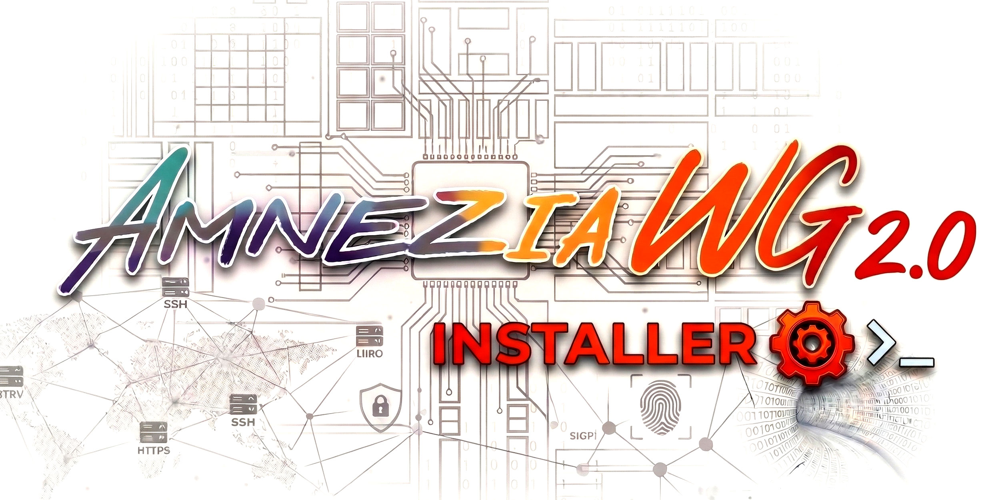

<p align="center">
  🇷🇺 <a href="README.md">Русский</a> | 🇬🇧 <b>English</b>
</p>

<p align="center">
  
</p>

<p align="center">
  <strong>A set of Bash scripts for one-command installation, secure hardening,<br>
  and easy management of an AmneziaWG 2.0 VPN server on Ubuntu 24.04 LTS Minimal</strong>
</p>

<p align="center">
  
  <a href="https://github.com/bivlked/amneziawg-installer/blob/main/LICENSE"></a>
  
  <a href="https://github.com/bivlked/amneziawg-installer/releases"></a>
  
  <a href="https://github.com/bivlked/amneziawg-installer/actions/workflows/shellcheck.yml"></a>
</p>

<p align="center">
  <a href="#features">Features</a> •
  <a href="#requirements">Requirements</a> •
  <a href="#hosting-recommendation">Hosting</a> •
  <a href="#installation">Installation</a> •
  <a href="#client-management">Management</a> •
  <a href="#additional-information">More</a> •
  <a href="#faq">FAQ</a> •
  <a href="#license">License</a>
</p>

---

<a id="features"></a>
## ✨ Features

* 🚀 **AmneziaWG 2.0:** Full support for the AWG 2.0 protocol with obfuscation parameters H1-H4 (ranges), S1-S4, CPS (I1).
* 🔧 **Native key generation:** All keys and configs are generated using Bash + `awg` with no external dependencies (Python/awgcfg.py removed).
* 🧹 **Automated system optimization:** Turns a bare Ubuntu VPS into a hardened VPN server — package cleanup (snapd, modemmanager, etc.), hardware-aware swap/NIC/sysctl tuning.
* 🔄 **Resume after reboot:** Installation can be safely interrupted (for required reboots) and resumed automatically.
* 🔒 **Secure by default:** UFW with SSH rate-limiting, optional IPv6 disable, strict file permissions, sysctl hardening, Fail2Ban.
* ⚙️ **Reliable DKMS:** Kernel module installed via DKMS with dependency and vermagic checks.
* 🎛️ **Flexible configuration:** Choose port, subnet, IPv6 mode, and routing mode at install time. `--endpoint` flag for servers behind NAT.
* 🧑‍💻 **Easy management:** Convenient `manage_amneziawg.sh` script for client and server operations.
* 🩺 **Diagnostics:** Detailed report with AWG 2.0 parameters (`--diagnostic`).
* 🗑️ **Clean uninstall:** Full removal (`--uninstall`).
* 📝 **Logging:** All actions logged to files in `/root/awg/`.

---

<a id="requirements"></a>
## 🖥️ Requirements

* **OS:** A **clean** installation of **Ubuntu Server 24.04 LTS Minimal**.
* **Access:** `root` privileges (via `sudo`).
* **Internet:** Stable connection.
* **Resources:** ~1 GB RAM (2+ GB recommended), ~3 GB disk space.
* **SSH:** SSH access to the server.

**OS Compatibility:**

| OS | Status | Notes |
|----|--------|-------|
| Ubuntu 24.04 LTS | ✅ Fully supported | Recommended |
| Ubuntu 25.10 | ⚠️ Experimental | May require building the kernel module from source |

* **Client:** [Amnezia VPN](https://github.com/amnezia-vpn/amnezia-client/releases) **>= 4.8.12.7** with AWG 2.0 support.
    > ⚠️ **Do not confuse** with `amneziawg-windows-client` — that is a different project (standalone tunnel manager) that **does not support** AWG 2.0.
    > ⚠️ **IMPORTANT:** If you use a **non-standard SSH port** (other than 22), you **MUST** add a rule `sudo ufw allow YOUR_PORT/tcp` **BEFORE** running the installer!

---

<a id="hosting-recommendation"></a>
## 🚀 Hosting Recommendation

For a stable, high-throughput VPN server, you need reliable hosting with a good network.

We've tested and recommend [**FreakHosting**](https://freakhosting.com/clientarea/aff.php?aff=392). Their **BUDGET VPS** lineup offers excellent value for money.

Their IPs are clean residential-grade, not flagged as datacenter — ideal for services that block VPN/datacenter IP ranges.

* **Recommended plan:** **BVPS-2**
* **Specs:** 2 vCPU, 2 GB RAM, 40 GB NVMe SSD.
* **Key advantage:** **10 Gbps** port with **unlimited traffic**. Perfect for VPN!
* **Price:** Just **€25 per year**.

This configuration is more than enough for comfortable AmneziaWG operation with many connections and heavy traffic.

---

<a id="installation"></a>
## 🔧 Installation (Recommended Method)

This installation method ensures correct handling of interactive prompts and colored output in your terminal.

1.  **Connect** to a **clean** Ubuntu 24.04 server via SSH.
    > **Tip:** After creating the server, wait 5-10 minutes for all background initialization processes to complete before starting the installation.

2.  **Download the script:**
    ```bash
    wget https://raw.githubusercontent.com/bivlked/amneziawg-installer/main/install_amneziawg.sh
    ```
3.  **Make it executable:**
    ```bash
    chmod +x install_amneziawg.sh
    ```
4.  **Run with `sudo`:**
    ```bash
    sudo bash ./install_amneziawg.sh
    ```
    *(You can also pass command-line parameters, see `sudo bash ./install_amneziawg.sh --help` or [ADVANCED.en.md#install-cli-adv](ADVANCED.en.md#install-cli-adv))*

    > **English version:** If you prefer English output during installation:
    > ```bash
    > wget https://raw.githubusercontent.com/bivlked/amneziawg-installer/main/install_amneziawg_en.sh
    > sudo bash ./install_amneziawg_en.sh
    > ```
    > The English version is functionally identical; only user-facing messages and logs are in English.
    > After reboots, resume with the same file: `sudo bash ./install_amneziawg_en.sh`

5.  **Initial setup:** The script will interactively ask for:
    * **UDP port:** Port for client connections (1024-65535). Default: `39743`.
    * **Tunnel subnet:** Internal VPN network. Default: `10.9.9.1/24`.
    * **Disable IPv6:** Recommended (`Y`) to prevent traffic leaks.
    * **Routing mode:** Determines which traffic goes through the VPN. Default `2` (Amnezia List + DNS) — recommended for best compatibility and bypassing restrictions.

    AWG 2.0 parameters (Jc, S1-S4, H1-H4, I1) are generated **automatically** — no action required.

6.  **Reboots:** **TWO** reboots are required. The script will ask for confirmation `[y/N]`. Type `y` and press Enter.

7.  **Resume:** After each reboot, **run the script again** with the same command:
    ```bash
    sudo bash ./install_amneziawg.sh
    ```
    The script will automatically resume from where it left off **without repeating any prompts**.

8.  **Completion:** After the second reboot and the third script run, you will see the message:
    `AmneziaWG 2.0 installation and configuration completed SUCCESSFULLY!`

**File locations:**

* Working directory, logs, client files: `/root/awg/`
* Server configuration: `/etc/amnezia/amneziawg/awg0.conf`
* Script settings file: `/root/awg/awgsetup_cfg.init`
* Management script: `/root/awg/manage_amneziawg.sh`
* Shared functions: `/root/awg/awg_common.sh`

---

<a id="client-management"></a>
## 👥 Client Management (`manage_amneziawg.sh`)

The `manage_amneziawg.sh` script is downloaded automatically during installation.

**Usage:**

```bash
sudo bash /root/awg/manage_amneziawg.sh <command> [arguments]
```

**Main commands:** (Full list: `... help` or [ADVANCED.en.md#manage-commands-adv](ADVANCED.en.md#manage-commands-adv))

| Command   | Arguments              | Description                    | Restart? |
| :-------- | :--------------------- | :----------------------------- | :------: |
| `add`     | `<client_name>`        | Add a client                   |   **Yes** |
| `remove`  | `<client_name>`        | Remove a client                |   **Yes** |
| `list`    | `[-v]`                 | List clients (`-v` for details)|    No     |
| `regen`   | `[client_name]`        | Regenerate files (all/one)     |    No     |
| `modify`  | `<name> <param> <val>` | Modify a client parameter      |    No     |
| `backup`  |                        | Create a backup                |    No     |
| `restore` | `[file]`               | Restore from backup            |    No     |
| `show`    |                        | Run `awg show`                 |    No     |
| `check`   |                        | Check server status            |    No     |
| `restart` |                        | Restart AmneziaWG service      |    -      |

> **❗️ IMPORTANT:** After `add` or `remove`, **restart the service**: `sudo systemctl restart awg-quick@awg0` (or use the `restart` command).

**Getting client files:** The `.conf` and `.png` files are located in `/root/awg/`. Use `scp`, `sftp`, or any other secure method to copy them.

### 📌 Quick Reference

```bash
# Installation (Russian)
wget https://raw.githubusercontent.com/bivlked/amneziawg-installer/main/install_amneziawg.sh
sudo bash ./install_amneziawg.sh          # Run (+ 2 reboots)

# Installation (English)
wget https://raw.githubusercontent.com/bivlked/amneziawg-installer/main/install_amneziawg_en.sh
sudo bash ./install_amneziawg_en.sh       # Run (+ 2 reboots)

# Client management
sudo bash /root/awg/manage_amneziawg.sh add my_phone       # Add
sudo bash /root/awg/manage_amneziawg.sh remove my_phone    # Remove
sudo bash /root/awg/manage_amneziawg.sh list                # List
sudo bash /root/awg/manage_amneziawg.sh regen               # Regenerate

# Maintenance
sudo bash /root/awg/manage_amneziawg.sh check               # Diagnostics
sudo bash /root/awg/manage_amneziawg.sh backup               # Backup
sudo bash /root/awg/manage_amneziawg.sh restart              # Restart
sudo systemctl restart awg-quick@awg0                        # After add/remove
```

---

<a id="additional-information"></a>
## ℹ️ Additional Information

For detailed information on configuration, security settings, AWG 2.0 parameters, management commands, technical details, and more, see **[ADVANCED.en.md](ADVANCED.en.md)**.

For the changelog, see **[CHANGELOG.en.md](CHANGELOG.en.md)**.

---

<a id="faq"></a>
## ❓ FAQ

<details>
  <summary><strong>Q: Will it survive a kernel update?</strong></summary>
  <b>A:</b> Yes, DKMS should automatically rebuild the module. Verify with <code>dkms status</code>.
</details>

<details>
  <summary><strong>Q: How do I completely uninstall AmneziaWG?</strong></summary>
  <b>A:</b> Download the installer script (if you don't have it) and run: <code>sudo bash ./install_amneziawg.sh --uninstall</code>.
</details>

<details>
  <summary><strong>Q: Clients can't connect — what should I do?</strong></summary>
  <b>A:</b> 1. Check status: <code>sudo bash /root/awg/manage_amneziawg.sh check</code>. 2. Check firewall: <code>sudo ufw status verbose</code>. 3. Verify client config. 4. Check logs: <code>sudo journalctl -u awg-quick@awg0 -n 50</code>. 5. Make sure the Amnezia VPN client is version <b>>= 4.8.12.7</b>.
</details>

<details>
  <summary><strong>Q: Can I use this with AWG 1.x clients?</strong></summary>
  <b>A:</b> No. AWG 2.0 is not compatible with AWG 1.x. All clients must support the 2.0 protocol. For AWG 1.x, use the <a href="https://github.com/bivlked/amneziawg-installer/tree/legacy/v4">legacy/v4</a> branch.
</details>

<details>
  <summary><strong>Q: Config import error "Invalid key: s3" — what's wrong?</strong></summary>
  <b>A:</b> You're using <code>amneziawg-windows-client</code> (a standalone tunnel manager) that <b>does not support</b> AWG 2.0. Install the full <a href="https://github.com/amnezia-vpn/amnezia-client/releases"><b>Amnezia VPN</b></a> client version <b>>= 4.8.12.7</b> — it supports all AWG 2.0 parameters (S3, S4, I1, H1-H4 ranges).
</details>

<details>
  <summary><strong>Q: How do I update the scripts to a newer version?</strong></summary>
  <b>A:</b> Download the updated scripts and replace them on the server:
  <pre>
  # Russian version:
  wget -O /root/awg/manage_amneziawg.sh https://raw.githubusercontent.com/bivlked/amneziawg-installer/main/manage_amneziawg.sh
  wget -O /root/awg/awg_common.sh https://raw.githubusercontent.com/bivlked/amneziawg-installer/main/awg_common.sh
  chmod 700 /root/awg/manage_amneziawg.sh /root/awg/awg_common.sh

  # English version:
  wget -O /root/awg/manage_amneziawg.sh https://raw.githubusercontent.com/bivlked/amneziawg-installer/main/manage_amneziawg_en.sh
  wget -O /root/awg/awg_common.sh https://raw.githubusercontent.com/bivlked/amneziawg-installer/main/awg_common_en.sh
  chmod 700 /root/awg/manage_amneziawg.sh /root/awg/awg_common.sh
  </pre>
  Server reinstallation is not required.
</details>

<details>
  <summary><strong>Q: What is the maximum number of clients?</strong></summary>
  <b>A:</b> A <code>/24</code> subnet supports up to 253 clients (.2 — .254), which is sufficient for most use cases.
</details>

<details>
  <summary><strong>Q: Which hosting providers work well?</strong></summary>
  <b>A:</b> Any VPS with Ubuntu 24.04, root access, and at least 1 GB RAM. We recommend providers with clean (non-blacklisted) IPs and unlimited traffic. See our <a href="#hosting-recommendation">recommendation</a>.
</details>

<details>
  <summary><strong>Q: How do I migrate the VPN to another server?</strong></summary>
  <b>A:</b> 1. Create a backup: <code>sudo bash /root/awg/manage_amneziawg.sh backup</code>. 2. Copy the backup to the new server. 3. Install AmneziaWG on the new server. 4. Restore: <code>sudo bash /root/awg/manage_amneziawg.sh restore /path/to/backup.tar.gz</code>. 5. Regenerate configs: <code>sudo bash /root/awg/manage_amneziawg.sh regen</code>.
</details>

> More answers and solutions in **[ADVANCED.en.md](ADVANCED.en.md)**.

---

## 🛠️ Troubleshooting

1.  **Logs:** `/root/awg/install_amneziawg.log`, `/root/awg/manage_amneziawg.log`
2.  **Service status:** `sudo systemctl status awg-quick@awg0`
3.  **AmneziaWG status:** `sudo awg show`
4.  **UFW status:** `sudo ufw status verbose`
5.  **Diagnostic report:** `sudo bash ./install_amneziawg.sh --diagnostic`
    For a detailed breakdown of the report, see [ADVANCED.en.md](ADVANCED.en.md#diagnostic-report-adv).

---

<a id="license"></a>
## 📝 License & Author

* **Author:** @bivlked - [GitHub](https://github.com/bivlked)
* **License:** MIT License (see `LICENSE` file in the repository)

---

<p align="center">
  <a href="#">↑ Back to top</a>
</p>
